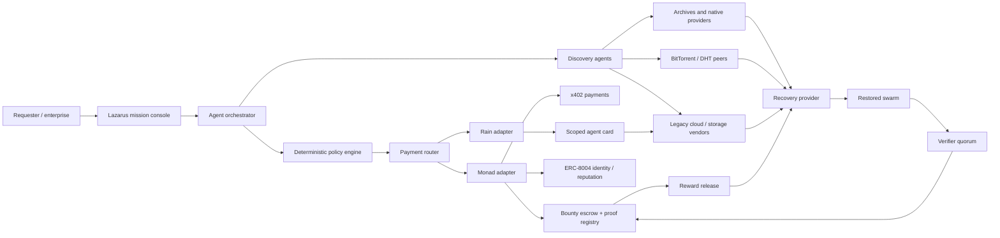
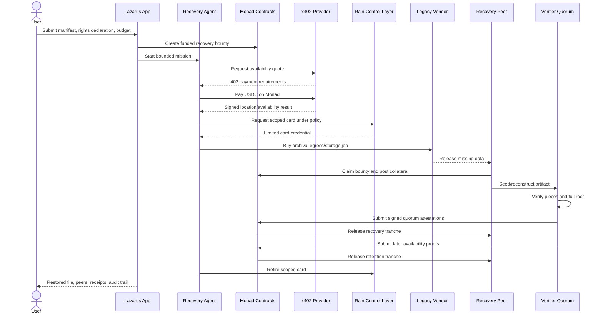

# Lazarus Mesh: Master Product and Hackathon Blueprint

**Product:** Lazarus Mesh  
**Protocol:** Lazarus Recovery Protocol  
**Tagline:** Autonomous agents resurrect lost digital knowledge.  
**Hackathon:** Raingentic Commerce Hackathon 2026  
**Core platforms:** Monad + Rain  
**Document status:** complete concept; validate private Rain API details with sponsors before implementation.

---

## 1. One-sentence idea

Lazarus Mesh is an agentic recovery marketplace where users fund bounties for unavailable, legally authorized digital artifacts; autonomous agents discover copies, purchase missing data or infrastructure, reconstruct and verify the artifact, reseed it, and release payment only after cryptographic and multi-agent verification.

---

## 2. The problem

Content-addressed networks promise durable distribution, but content still disappears when nobody remains online to serve it.

Examples:

- an open research dataset has a torrent file but zero seeders;
- an abandoned open-source package release is referenced but unavailable;
- an old model checkpoint disappears from its original host;
- a company has a backup manifest but one accessible copy is offline;
- public-domain archives exist on old drives but have no economic reason to return;
- creators want old authorized work restored without operating permanent infrastructure.

Current failure:

```text
Known hash + zero available peers = no recovery market
```

Someone may possess the missing bytes. They have no discovery mechanism, payment guarantee, or reason to spend bandwidth restoring them. The requester has no reliable way to verify delivery before paying. Storage markets sell new storage; they generally do not coordinate recovery of already-lost content across onchain and conventional providers.

---

## 3. The solution

Lazarus turns unavailable data into an autonomous procurement mission.

1. Requester supplies a `.torrent` file or cryptographic manifest, ownership/license declaration, budget, and desired availability period.
2. Sponsor funds a recovery bounty.
3. Discovery agents search peer networks, archives, storage vendors, and registered recovery providers.
4. Treasury agent chooses the cheapest policy-compliant payment rail.
5. Monad pays machine-native providers, escrows the bounty, and records proofs/reputation.
6. Rain gives the agent bounded purchasing power for ordinary card-based storage, cloud, egress, and data-recovery vendors.
7. Recovery provider stakes collateral and begins serving the artifact.
8. Independent verifier agents reconstruct and challenge the data.
9. Contract releases reward after quorum verification.
10. A retained reward tranche incentivizes continued seeding.
11. New seeders extend availability beyond the original requester.

### Product promise

> Pay for verified recovery, not promises. Restore once; benefit the network repeatedly.

---

## 4. Critical repositioning

The original BitLazarus concept used Bitcoin Lightning hold invoices. That architecture does not fit a Rain + Monad hackathon.

Recommended changes:

| Original | Lazarus Mesh |
|---|---|
| Bitcoin/Lightning settlement | Monad USDC, x402, and smart-contract escrow |
| Mostly human marketplace | Autonomous discovery, routing, purchasing, verification, and reseeding agents |
| Payment after buyer confirmation | Cryptoeconomic verification and verifier quorum |
| Torrent-only framing | Recovery protocol; BitTorrent is one transport |
| Crypto-only providers | Monad-native providers plus legacy vendors paid through Rain |
| “Dead torrent” pitch | Preservation of authorized digital knowledge |
| Ambiguous copyright posture | Public-domain, open-license, creator-authorized, or enterprise-owned artifacts only |

Keep `BitLazarus` only as historical inspiration. Use **Lazarus Mesh** publicly; “Bit” implies Bitcoin and weakens Monad positioning.

---

## 5. Why Rain and Monad both matter

### Monad: protocol core — approximately 65% of technical story

Monad provides:

- stablecoin bounty escrow;
- provider collateral;
- job and proof registry;
- x402 machine-to-machine payments;
- fast, low-cost recovery micropayments;
- EIP-712 verifier attestations;
- transparent reward release;
- provider/verifier identity and reputation through ERC-8004 where practical;
- public policy and receipt commitments;
- permanent recovery history without storing file contents onchain.

### Rain: real-world commerce and control — approximately 35% of technical story

Rain provides:

- an Agent Control Layer for bounded purchasing authority;
- scoped cards for storage, cloud, bandwidth, seedbox, archival, and recovery vendors that do not accept crypto;
- merchant, MCC, amount, transaction-count, and expiry restrictions;
- wallet/onramp/offramp or payment functions if enabled in the hackathon sandbox;
- linkage between an agent and a verified human/business principal;
- real-world payment reach beyond crypto-native sellers;
- a second enforcement layer independent of the model.

### Essential relationship

Monad is where the recovery market coordinates and settles. Rain lets the recovery agent cross into the existing commercial internet safely. Remove Monad: no open recovery protocol. Remove Rain: agent cannot safely purchase from most conventional infrastructure vendors.

---

## 6. System architecture



### Trust boundaries

```text
LLM: proposes plan only
Policy engine: authorizes actions
Rain: enforces card/payment limits
Monad contract: escrows and releases reward
Verifier quorum: attests offchain data recovery
BitTorrent/content hashes: verify bytes
```

No single LLM response can create unrestricted payment authority or release the bounty.

---

## 7. Complete recovery sequence



---

## 8. User groups

### 8.1 Recovery sponsor

Person or organization seeking an artifact.

Needs:

- confidence that payment releases only after verification;
- a simple legal-rights declaration;
- maximum budget and deadline;
- visible recovery progress;
- final retrieval plus continued availability;
- auditable spending.

### 8.2 Recovery provider

Person, archive, company, or agent controlling a copy or able to recover one.

Needs:

- credible funded bounty;
- clear success criteria;
- payment certainty;
- reasonable collateral;
- privacy where allowed;
- growing reputation.

### 8.3 Verifier operator

Independent agent/node validating content and availability.

Needs:

- small per-job fee;
- deterministic challenge rules;
- protection from oversized/malicious files;
- reputation for correct attestations.

### 8.4 Preservation sponsor

University, foundation, protocol, library, open-source project, or company funding public recovery missions.

Needs:

- portfolio reporting;
- license controls;
- budget rules;
- measurable preservation impact.

### 8.5 Enterprise operator

Uses Lazarus for authorized backups, dependency artifacts, training datasets, or forensic archives.

Needs:

- private missions;
- verified providers;
- access controls;
- compliance and audit;
- fiat/card payment support.

---

## 9. Primary use cases

### Hackathon use case

Recover a synthetic open research dataset with zero initial seeders. The recovery agent buys one locator result through x402 and one archival/seedbox operation with a Rain scoped card, verifies the reconstructed file, and creates multiple new seeders.

### Production opportunities

1. **Open science:** restore cited datasets and experiment artifacts.
2. **Open source:** recover abandoned package releases and build artifacts.
3. **AI provenance:** recover authorized datasets, model cards, or checkpoints required to reproduce a model.
4. **Enterprise backup recovery:** procure data from approved archival vendors under strict budgets.
5. **Creator archives:** restore creator-owned releases with explicit authorization.
6. **Public-domain preservation:** rescue historical documents, media, and government datasets.
7. **Dependency resilience:** monitor important artifacts and launch recovery before availability reaches zero.
8. **Evidence preservation:** recover content when chain of custody and hashes are already known; legal review required.

### Explicit exclusions

- searching for commercial movies, games, books, music, or software without authorization;
- DRM circumvention;
- stolen or leaked data;
- malware datasets without controlled research handling;
- personal-data dumps;
- content prohibited by law, sanctions, Rain terms, or infrastructure providers;
- “find this title” missions without a known cryptographic commitment and rights basis.

---

## 10. Mission input requirements

MVP accepts:

- `.torrent` metadata file; or
- a Lazarus manifest containing file list, lengths, piece hashes, and final SHA-256/Merkle root.

Required fields:

```ts
interface RecoveryMissionInput {
  title: string;
  manifestType: "torrent_v1" | "torrent_hybrid" | "lazarus_manifest";
  infoHash?: string;
  contentRootSha256: string;
  totalBytes: bigint;
  pieceCount: number;
  licenseClass: "public_domain" | "open_license" | "owner_authorized" | "enterprise_owned";
  licenseEvidenceUrl?: string;
  rightsAttestation: boolean;
  maximumBudgetMinor: bigint;
  rewardMinor: bigint;
  providerStakeMinor: bigint;
  deadline: string;
  availabilityEpochs: number;
  minVerifierQuorum: number;
}
```

### Why magnet-only is insufficient

A magnet infohash may identify content but, with no peers, the complete metadata and piece hashes may also be unavailable. The MVP requires a `.torrent` file or manifest so recovered bytes can be verified independently. A title or filename alone cannot produce trustworthy recovery.

---

## 11. Data integrity model

BitTorrent v1 defines piece hashes and an infohash; BitTorrent v2 uses SHA-256 Merkle trees over file blocks. For fast implementation:

- use v1-compatible torrent transport for broad library support;
- verify its piece hashes during transfer;
- also create an independent SHA-256 Merkle commitment for onchain proof;
- consider hybrid v1/v2 torrents in production.

Primary references: [BitTorrent BEP 3](https://www.bittorrent.org/beps/bep_0003.html), [BitTorrent BEP 52](https://www.bittorrent.org/beps/bep_0052.html).

### Three verification levels

#### Level 1: piece integrity

Every downloaded piece matches the manifest's expected hash.

#### Level 2: complete reconstruction

At least two independent verifiers reconstruct the complete artifact and produce the same canonical SHA-256 root.

#### Level 3: continuing availability

Verifier agents successfully retrieve randomly selected pieces across later epochs from the restored swarm.

### Honest claim

Lazarus is **cryptoeconomically verified**, not perfectly trustless. Smart contracts cannot directly observe arbitrary peer-to-peer availability. Independent verifier quorum, randomized challenges, collateral, and delayed rewards reduce trust; they do not mathematically eliminate all collusion or network-observation risk.

---

## 12. Challenge and proof design

### Challenge generation

1. Provider claims bounty and deposits stake.
2. Contract records future `challengeBlock`.
3. After that block, challenge indices derive from:

```text
keccak256(missionId || provider || epoch || blockHash(challengeBlock) || counter)
mod pieceCount
```

4. Provider cannot know selected pieces before committing.
5. Verifiers request selected pieces through the recovery transport.
6. Verifiers validate each piece and sign an EIP-712 attestation.

### Attestation

```ts
interface RecoveryAttestation {
  missionId: `0x${string}`;
  provider: `0x${string}`;
  epoch: number;
  challengeBlock: bigint;
  challengeDigest: `0x${string}`;
  contentRoot: `0x${string}`;
  reconstructedBytes: bigint;
  result: "pass" | "fail";
  observedAt: bigint;
}
```

### Quorum

Hackathon:

- three known verifier agents;
- two signatures required;
- at least one full reconstruction;
- repeated random-piece probes.

Production:

- permissioned, staked, or reputation-weighted verifier set;
- geographic/network diversity;
- random assignment;
- verifier slashing for provably conflicting signatures;
- dispute window and appeal path.

### Limitation

A provider could selectively serve verifier IPs. Mitigation: verifiers use different networks, hidden challenge timing, full client reconstruction, DHT visibility checks, and continued third-party retrieval. Do not claim availability proof is absolute.

---

## 13. Reward mechanics

Recommended split:

| Tranche | Share | Release condition |
|---|---:|---|
| Recovery | 70% | Complete artifact reconstructed; root verified by quorum |
| Availability | 20% | Repeated successful challenges across configured epochs |
| Public-good replication | 10% | Minimum independent seeder count or additional verified replicas |

Hackathon can shorten epochs to minutes. Production uses hours/days.

### Provider stake

Purpose:

- prevent spam claims;
- discourage false availability claims;
- compensate verifier cost after obvious failure;
- make commitments economically credible.

Rules:

- returned on success;
- partially reduced only under deterministic, contract-defined failure conditions;
- not slashed merely for general network outage without sufficient evidence;
- capped relative to reward so small providers can participate.

### Verifier fee

Small fixed amount paid from bounty or protocol subsidy after valid attestation. A verifier cannot earn more by reporting failure.

### No project token

Use USDC and MON gas. A new token adds regulatory, liquidity, security, and pitch noise without improving the MVP.

---

## 14. Smart-contract design

### Contract 1: `RecoveryBountyRegistry`

Responsibilities:

- create mission;
- escrow reward;
- record manifest/content root;
- accept provider claim and collateral;
- establish challenge blocks and deadlines;
- accept verifier attestations;
- enforce quorum;
- release reward tranches;
- refund expired unclaimed missions;
- emit all lifecycle events.

Core state:

```solidity
enum MissionStatus {
    Open,
    Claimed,
    Verifying,
    Recovered,
    Retaining,
    Completed,
    Expired,
    Disputed
}

struct Mission {
    address sponsor;
    address provider;
    bytes32 contentRoot;
    bytes32 manifestHash;
    uint128 reward;
    uint128 stakeRequired;
    uint64 deadline;
    uint32 pieceCount;
    uint16 requiredQuorum;
    uint16 passedEpochs;
    MissionStatus status;
}
```

Core functions:

```text
createMission(...)
claimMission(missionId)
beginVerification(missionId)
submitAttestations(missionId, attestations, signatures)
finalizeRecovery(missionId)
finalizeAvailabilityEpoch(missionId, epoch, attestations)
completeMission(missionId)
expireMission(missionId)
cancelUnclaimedMission(missionId)
```

### Contract 2: `VerifierRegistry` — stretch

- approved verifier addresses;
- reputation totals;
- conflicts and penalties;
- optional ERC-8004 link.

For hackathon, verifier addresses can be constructor-configured. Do not build governance.

### Contract 3: `PolicyReceiptRegistry` — optional

Stores only hashes of Rain policy, x402 receipt, and final recovery receipt. This connects real-world payment decisions to the same mission without exposing card or private transaction data.

### Contract security

- checks-effects-interactions;
- `SafeERC20`;
- reentrancy guard on release/refund;
- explicit state-transition checks;
- replay-safe EIP-712 domain and attestation nonce;
- no arbitrary external calls;
- emergency pause for hackathon contract owner;
- fixed supported stablecoin address per deployment;
- bounded arrays and verifier count;
- events for every external state change.

---

## 15. x402 design

Use x402 for machine-native services, not the entire escrow.

### Paid service 1: availability intelligence

```text
GET /x402/availability/{contentRoot}
```

Response after payment:

```json
{
  "contentRoot": "0x...",
  "candidateProviders": 2,
  "estimatedRecoverySeconds": 45,
  "estimatedCostUsd": "0.015",
  "signedAt": "2026-08-09T14:00:00Z",
  "signature": "0x..."
}
```

### Paid service 2: verified piece retrieval

```text
GET /x402/piece/{missionId}/{pieceIndex}
```

Returns piece bytes or a short-lived authenticated retrieval location plus provider signature.

### Paid service 3: verifier attestation — stretch

```text
POST /x402/verify
```

Buyer pays verifier to execute a bounded challenge. Result includes EIP-712 attestation.

### Monad testnet values

Current official guide lists:

```ts
const monadTestnet = {
  chainId: 10143,
  caip2: "eip155:10143",
  testUsdc: "0x534b2f3A21130d7a60830c2Df862319e593943A3",
  facilitator: "https://x402-facilitator.molandak.org",
};
```

Re-verify immediately before implementation: [Monad x402 guide](https://docs.monad.xyz/guides/x402).

---

## 16. Rain integration design

Rain APIs are private. Exact endpoint names below are internal domain interfaces, not claimed Rain schemas.

### Primary hackathon use: legacy recovery purchase

The treasury agent determines that a conventional archive/seedbox/cloud vendor has the required missing data or infrastructure. It asks Rain for a scoped card:

```ts
interface RecoveryPurchasePolicy {
  principalId: string;
  missionId: string;
  allowedMerchantIds: string[];
  allowedMccs: string[];
  maximumAmountMinor: bigint;
  currency: "USD";
  maxTransactions: 1;
  expiresAt: string;
  purpose: "archival_egress" | "storage" | "bandwidth" | "recovery_service";
}
```

Desired Rain controls:

- approved merchant;
- cloud/storage/data-service MCC;
- one transaction;
- exact or maximum amount;
- 15-minute expiry;
- automatic retirement after authorization or timeout;
- principal linked to verified user/business;
- policy change only through human admin.

### Secondary uses if sandbox enables them

- requester funds bounty through a Rain wallet/onramp;
- stablecoin contributor earnings move through Rain offramps;
- provider spends earnings via Rain-connected card;
- approved-recipient policy for offchain payouts.

### Required live demo events

1. Agent requests Rain payment authority.
2. Rain returns scoped card or equivalent bounded payment object.
3. Allowed test transaction succeeds.
4. Oversized or wrong-category test transaction fails.
5. Credential freezes/retires.

### Adapter

```ts
interface RainAdapter {
  createScopedCard(policy: RecoveryPurchasePolicy): Promise<{
    cardId: string;
    state: "pending" | "active";
    lastFour?: string;
    expiresAt: string;
  }>;
  getCard(cardId: string): Promise<unknown>;
  listTransactions(cardId: string): Promise<unknown[]>;
  freezeCard(cardId: string): Promise<void>;
  retireCard(cardId: string): Promise<void>;
  verifyWebhook(rawBody: Uint8Array, headers: Headers): RainEvent;
}
```

### Rain fallback rule

Obtain sponsor confirmation first. If scoped cards are unavailable, use the strongest real Rain feature exposed in the hackathon tenant—payment, wallet, onramp, or offramp—and adjust the mission. Do not fabricate endpoints or present simulation as live.

---

## 17. Agent system

### Agent roles

#### Mission planner

- turns human request into structured recovery plan;
- estimates steps and maximum exposure;
- cannot spend.

#### Rights/compliance agent

- validates required declaration and license evidence fields;
- checks blocked-hash list;
- flags sensitive or prohibited content;
- cannot make a final legal determination; uncertain missions stop for human review.

#### Discovery agent

- searches registered providers, DHT/trackers, archives, and approved vendors;
- requests paid x402 availability intelligence;
- returns signed candidate quotes.

#### Treasury/router agent

- selects x402, Monad escrow, or Rain scoped card;
- deterministic router makes final decision;
- never sees unrestricted credentials.

#### Recovery agent

- coordinates provider claim, retrieval, reconstruction, and reseeding;
- watches deadlines and progress.

#### Verifier agents

- retrieve random pieces;
- reconstruct complete artifact;
- sign attestations;
- cannot release funds individually.

#### Reconciliation agent

- matches Rain events, x402 receipts, Monad transactions, and recovery results;
- writes final report;
- retires unused payment authority.

### Important simplification

These roles can be modules in one orchestrator. Do not build six independent LLM services. Use one planner plus deterministic workers and three verifier processes.

---

## 18. Policy engine

Model proposes. Code decides.

### Policy inputs

- mission active and unexpired;
- artifact rights declaration accepted;
- content hash not blocked;
- provider/merchant approved;
- rail allowed;
- amount within per-step and mission limits;
- transaction count available;
- purpose allowed;
- human approval present above threshold;
- no global kill switch;
- idempotency key unused.

### Reason codes

```text
POLICY_OK
RIGHTS_EVIDENCE_REQUIRED
CONTENT_HASH_BLOCKED
MISSION_INACTIVE
MISSION_EXPIRED
PROVIDER_NOT_ALLOWED
MERCHANT_NOT_ALLOWED
MCC_NOT_ALLOWED
RAIL_NOT_ALLOWED
PER_TRANSACTION_LIMIT_EXCEEDED
TOTAL_BUDGET_EXCEEDED
APPROVAL_REQUIRED
DUPLICATE_INTENT
KILL_SWITCH_ACTIVE
```

### Rail selection

```text
x402-supported machine service -> Monad x402
funded recovery bounty -> Monad escrow
card-only approved infrastructure vendor -> Rain scoped card
approved bank/local payout -> Rain payment, if enabled
unsupported recipient -> stop
```

---

## 19. Product screens

### Screen 1: Recovery mission

- upload `.torrent`/manifest;
- show content root, bytes, pieces;
- license class and evidence;
- bounty, stake, deadline, availability period;
- maximum total agent budget;
- human approval threshold;
- “Plan” action.

### Screen 2: Mission plan

- proposed search sources;
- estimated price per rail;
- maximum financial exposure;
- policy simulation;
- actions requiring approval;
- “Fund and start” action.

### Screen 3: Recovery command center

Main visual:

```text
Availability: DEAD -> DISCOVERED -> RECOVERING -> VERIFIED -> RESEEDED
Pieces:       0/16 -> 4/16 -> 16/16
Seeders:      0 -> 1 -> 3
```

Timeline:

- bounty funded on Monad;
- x402 availability quote purchased;
- provider selected;
- collateral posted;
- Rain scoped card issued;
- legacy archive purchase authorized;
- random pieces challenged;
- verifier 1 passed;
- verifier 2 passed;
- full root matched;
- reward released;
- new seeders observed;
- Rain card retired.

### Screen 4: Verification

- expected root vs reconstructed root;
- challenge indices;
- verifier identities/reputation;
- signatures;
- completed bytes;
- availability epochs;
- Monad explorer links.

### Screen 5: Financial audit

- bounty amount;
- provider stake;
- x402 micropayments;
- Rain transaction, masked metadata only;
- reward tranches;
- remaining budget;
- blocked payment attempt and reason;
- receipt hashes.

### Screen 6: Restored artifact

- success state;
- safe download/magnet link;
- current seeders;
- license;
- recovery timestamp;
- public impact: requester plus network availability.

---

## 20. Hackathon demo

### Test artifact

Create a harmless synthetic open research dataset:

```text
rainfall-model-training-sample-v1.zip
Size: 1–5 MB
Pieces: 16–32
License: CC0
Initial seeders: 0
```

Keep file small enough for deterministic live recovery but large enough to visualize pieces.

### Demo actors

- requester account;
- orchestrator/recovery agent;
- native x402 availability provider;
- legacy archive vendor simulator with real Rain sandbox transaction;
- provider node holding complete artifact;
- three verifier nodes;
- two final seeder nodes.

### Four-minute script

#### 0:00–0:30 — problem

“This open dataset has a valid manifest and zero seeders. Its bytes may exist, but there is no market to recover them.”

#### 0:30–1:00 — mission

Upload manifest. Set $5 bounty and $15 maximum infrastructure budget. Show rights evidence and policy.

#### 1:00–1:40 — autonomous discovery and payments

Agent buys an availability result through x402 on Monad. It discovers one card-only archive and requests a one-use Rain scoped card.

#### 1:40–2:10 — control proof

Allowed archive purchase succeeds. A $100 unrelated purchase is denied because amount/MCC violates policy.

#### 2:10–3:10 — resurrection

Provider stakes. Pieces turn green. Verifiers challenge random pieces and reconstruct full root. Screen transitions `DEAD -> VERIFIED`.

#### 3:10–3:40 — payout and network effect

Monad releases reward. Two new seeders appear. Rain card retires.

#### 3:40–4:00 — close

“Monad created the open machine recovery market. Rain let the agent safely buy from the existing internet. One requester paid; the whole network regained the data.”

### Backup

Record a clean video after first successful run. Keep labeled simulation fixtures for external outage, but prioritize real Rain and Monad transactions.

---

## 21. Judge-facing differentiation

### Not a storage service

Storage services preserve data after upload. Lazarus creates economic coordination after availability has already failed.

### Not a torrent search engine

Lazarus requires a known cryptographic commitment and rights basis. It does not index entertainment titles or facilitate content discovery.

### Not a bounty board

Agents discover, procure, verify, reconcile, and reseed autonomously. Contracts enforce payment; humans do not manually decide delivery.

### Not another x402 file store

Existing services sell uploads or downloadable files. Lazarus recovers already-unavailable artifacts, verifies reconstruction, and pays for ongoing public availability across crypto-native and card-only providers.

### Not a decorative Rain integration

The recovery agent cannot access card-only infrastructure without Rain. Rain independently restricts where, how much, how often, and how long the agent can spend.

### Not a decorative Monad integration

Monad holds bounty and collateral, handles x402, receives proof attestations, releases reward, and records provider reputation. It is the protocol state machine.

---

## 22. Business model

### Marketplace revenue

- 3–8% success fee on released recovery rewards;
- no fee when recovery fails;
- optional verification fees;
- optional long-term availability extensions.

### Enterprise SaaS

- monthly monitoring of important artifacts;
- private recovery missions;
- approved-provider networks;
- policy templates and roles;
- compliance exports;
- SLA and support;
- advanced Rain funding/offramp integrations.

### Public-good funding

- universities sponsor preservation pools;
- foundations fund open-data rescue campaigns;
- protocols protect dependency/build artifacts;
- creators sponsor legacy-catalog availability.

### Future API

```text
POST /missions
GET  /missions/{id}
POST /manifests/verify
GET  /availability/{contentRoot}
POST /recovery/quote
GET  /receipts/{id}
```

### Economic flywheel

```text
More funded missions
-> more recovery providers
-> faster recovery and better coverage
-> stronger provider reputation
-> more trusted enterprise usage
-> larger preservation budgets
-> more funded missions
```

---

## 23. Legal and content-safety design

This section is product planning, not legal advice. Obtain counsel before public launch.

### Hackathon safety posture

- use only a team-created CC0 dataset;
- no public submission search;
- no copyrighted entertainment content;
- no user-generated public swarms;
- rights declaration visible in demo;
- no DRM or access-control circumvention.

### Production controls

- require license class and signed rights attestation;
- store evidence URL/hash;
- denylist prohibited content hashes;
- content and sanctions policy;
- designated abuse/copyright channel;
- repeat-infringer policy;
- notice-and-takedown workflow;
- counter-notice workflow where applicable;
- disable marketplace discovery and payment for disputed hashes;
- retain necessary compliance records;
- jurisdiction and provider terms review;
- human review for ambiguous license evidence.

U.S. service providers seeking relevant DMCA safe-harbor protections must satisfy statutory conditions that can include a designated agent, notice-and-takedown process, and repeat-infringer policy. See the [U.S. Copyright Office Section 512 resources](https://www.copyright.gov/512/index.html).

### Privacy

- no file contents onchain;
- no peer IP addresses onchain;
- hash sensitive manifests before public commitment;
- private enterprise missions use authenticated transport;
- separate public proof from private retrieval metadata;
- never send data payloads or credentials to an LLM.

---

## 24. Threat model

| Threat | Attack | Mitigation |
|---|---|---|
| Fake provider | Claims bounty without data | Stake, future random challenge, full reconstruction |
| Selective availability | Serves only verifiers | Multiple networks, hidden timing, client reconstruction, later probes |
| Verifier collusion | Signs false recovery | Quorum, reputation, conflict evidence, random assignment |
| Sponsor fraud | Refuses payment after delivery | Pre-funded smart-contract escrow |
| Prompt injection | Malicious metadata makes agent spend | Treat metadata as untrusted data; deterministic policy |
| Card theft | Agent credential leaks | Server-side keys, scoped card, one use, short expiry, Rain controls |
| Payment replay | Duplicate Rain/x402 request | Idempotency keys, nonces, webhook event uniqueness |
| Contract reentrancy | Repeated reward withdrawal | State transition before transfer, guard, pull where appropriate |
| Hash substitution | Provider serves different data | Immutable manifest/content root |
| Rights fraud | User lies about authorization | Attestation, evidence, takedown, account action, human review |
| Malware | Restored artifact attacks verifier/user | Isolated download, file-type policy, malware scanning, no execution |
| Decompression bomb | Tiny archive expands massively | declared size limits, sandbox, CPU/storage quotas |
| Sybil seeders | One provider pretends to be many | distinct verifier observations; do not rely solely on peer count |
| Oracle/RPC outage | Finalization stalls | bounded retries, alternate approved RPC, delayed finalization |
| x402 facilitator flaw | Incorrect settlement or replay | strict receipt validation, amount/network/recipient binding, caps |

### Kill switches

- stop new missions;
- stop agent external spending;
- freeze all active Rain cards;
- pause contract mission creation/finalization;
- block a content root;
- disable a provider/verifier.

---

## 25. Technical stack

### Frontend

- Next.js + TypeScript;
- mission wizard;
- real-time timeline through server-sent events;
- piece-grid visualization;
- Rain and Monad receipt links;
- no sensitive secrets/card data in browser.

### Backend/orchestrator

- Node.js + TypeScript;
- Zod schemas;
- deterministic state machine;
- Rain adapter;
- Monad/viem adapter;
- x402 v2 buyer and seller;
- torrent worker adapter;
- SQLite for hackathon, Postgres later.

### Chain

- Solidity;
- Monad testnet;
- Foundry for contracts/tests;
- OpenZeppelin ERC-20/security helpers;
- `viem` 2.40.0 or later per current Monad guidance.

### Recovery transport

Hackathon:

- Node WebTorrent or another locally verified BitTorrent implementation;
- controlled local/WebSocket tracker for deterministic peers;
- independent SHA-256 Merkle manifest;
- multiple worker processes for provider/verifiers/seeders.

Production:

- libtorrent/native service;
- DHT and tracker support;
- hybrid BitTorrent v1/v2 manifests;
- optional IPFS, HTTP range, S3, or archive adapters.

### LLM

- one structured mission planner;
- no LLM required for verification, hashing, routing, payment limits, or contract decisions;
- deterministic saved plan fallback.

---

## 26. Suggested repository layout

```text
apps/
  web/                    # Next.js UI
  orchestrator/           # mission state machine and agents
  x402-provider/          # paid availability/piece endpoint
  recovery-worker/        # provider, verifier, seeder modes
packages/
  domain/                 # shared types and state transitions
  policy/                 # deterministic policy engine
  rain-adapter/           # live + mock Rain integration
  monad-adapter/          # viem, contracts, receipt parsing
  torrent/                # manifests, hashing, peer worker
contracts/
  src/RecoveryBountyRegistry.sol
  test/RecoveryBountyRegistry.t.sol
  script/Deploy.s.sol
fixtures/
  cc0-rainfall-dataset/
  torrent/
  rain-webhooks/
docs/
  demo-script.md
  sponsor-questions.md
```

If hackathon time is tight, keep one Next.js app and one `contracts` folder. Structure is secondary to the working loop.

---

## 27. Core database model

```text
principals
missions
manifests
plans
policies
providers
provider_quotes
payment_intents
rain_cards
x402_receipts
chain_transactions
recovery_pieces
verification_epochs
attestations
events
webhook_receipts
content_blocks
```

### Mission state

```text
draft
-> rights_checked
-> planned
-> awaiting_approval
-> funded
-> discovering
-> claimed
-> recovering
-> verifying
-> recovered
-> retaining
-> completed

Terminal alternatives:
blocked | expired | cancelled | failed | disputed
```

### Payment state

```text
proposed -> policy_checked -> approved -> submitted
-> authorized -> settled
-> declined
-> reversed
-> expired
```

### Event rules

- append-only audit events;
- unique external event/transaction IDs;
- explicit allowed state transitions;
- source, timestamp, correlation ID, and redacted payload hash;
- UI derived from server state, never optimistic payment success.

---

## 28. API surface

### Missions

```text
POST /api/missions
GET  /api/missions/{id}
POST /api/missions/{id}/plan
POST /api/missions/{id}/approve
POST /api/missions/{id}/start
POST /api/missions/{id}/cancel
GET  /api/missions/{id}/events
```

### Recovery

```text
POST /api/missions/{id}/discover
POST /api/missions/{id}/claim
POST /api/missions/{id}/verify
GET  /api/missions/{id}/pieces
GET  /api/missions/{id}/seeders
```

### Payments

```text
POST /api/missions/{id}/payment-intents
POST /api/missions/{id}/rain-card
POST /api/webhooks/rain
GET  /api/missions/{id}/receipts
```

### Security

- authenticated mission owner;
- CSRF protection for browser mutations;
- raw-body Rain webhook verification;
- idempotency key required for mutations;
- schema and size limits;
- rate limiting;
- no public direct executor endpoint.

---

## 29. MVP versus stretch

### Must ship

- one legal synthetic dead dataset;
- manifest upload and root display;
- mission policy and budget;
- deployed Monad bounty contract;
- real funded testnet bounty;
- real x402 payment on Monad;
- real Rain sandbox operation;
- allowed and blocked Rain transactions;
- provider claim/stake;
- real piece transfer/reconstruction;
- two-of-three verifier attestations;
- contract reward release;
- two active final seeder processes;
- complete audit/timeline screen;
- backup recording.

### Should ship

- ERC-8004 identity/reputation lookup;
- repeated availability epoch;
- policy/receipt hash registry;
- public explorer links;
- mobile-safe UI;
- one automated golden-path test.

### Stretch

- multiple competing provider quotes;
- live public DHT discovery;
- private enterprise mission;
- IPFS/HTTP/S3 transport adapters;
- reputation-weighted verifier selection;
- automatic Rain onramp/offramp;
- production dispute mechanism.

### Never prioritize during hackathon

- new token;
- DAO;
- full public torrent index;
- general browser agent;
- real copyrighted data;
- cross-chain bridge;
- complex zero-knowledge proofs;
- global verifier governance;
- production KYC;
- perfect decentralized storage proof.

---

## 30. Two-day build order

### Hour 0–2: sponsor validation

- Rain credentials and docs;
- exact scoped-card/payment feature;
- sandbox authorization/decline trigger;
- Rain webhook signature;
- Monad RPC, faucet, USDC, x402 facilitator;
- bounty requirement and judging rubric.

### Hour 2–6: prove external rails

- one authenticated Rain call;
- one bounded Rain payment object;
- one Monad USDC transaction;
- one x402 paid response;
- one local torrent seed/download.

Stop and escalate to sponsors if any core rail fails.

### Hour 6–12: protocol core

- deploy bounty contract;
- mission creation and claim;
- manifest hashing;
- verifier signatures;
- reward release test.

### Hour 12–18: product loop

- mission UI;
- policy engine;
- payment router;
- recovery workers;
- live event timeline.

### Hour 18–24: full demo

- Rain allowed purchase;
- Rain blocked purchase;
- x402 payment;
- reconstruction;
- quorum;
- payout;
- reseeding.

### Hour 24–30: stabilization

- error states;
- idempotency;
- redaction;
- timeouts;
- fixture reset;
- deploy.

### Hour 30–34: test and pitch

- three full clean runs;
- backup video;
- four-minute demo script;
- final screenshots/explorer links.

### Last hours

- submit early;
- no new features;
- keep test wallets funded;
- rehearse live and fallback paths.

---

## 31. Team split

### Three-person team

1. **Protocol engineer:** contracts, Monad, x402, verifier signatures.
2. **Payments/full-stack engineer:** Rain adapter, policy, state machine, backend.
3. **Recovery/product engineer:** torrent workers, UI, visualization, demo/pitch.

### Two-person team

1. Monad/contracts/recovery workers.
2. Rain/backend/UI/demo.

### Solo

Drop ERC-8004, retention epochs, public DHT, and multiple contracts. Keep one contract, one x402 call, one Rain call, one provider, two verifier processes, and one polished screen.

---

## 32. Test plan

### Contract

- mission cannot be created with zero reward/root;
- only open mission can be claimed;
- stake amount exact;
- same provider cannot claim twice;
- signatures bound to contract, chain, mission, epoch, and nonce;
- duplicate verifier ignored/rejected;
- quorum releases once;
- reentrancy cannot double-release;
- expiry refunds only valid amount;
- invalid state transitions revert.

### Policy

- exact-limit purchase passes;
- one-cent-over fails;
- wrong merchant fails;
- wrong MCC fails;
- expired authority fails;
- duplicate intent fails;
- aggregate budget enforced;
- kill switch blocks execution.

### Recovery

- corrupted piece rejected;
- missing piece leaves mission incomplete;
- complete reconstructed root matches;
- alternate bytes with same filename fail;
- malicious archive cannot execute code;
- file size/decompression limits work;
- verifier disagreement prevents release.

### Integrations

- x402 `402 -> sign/pay -> retry -> 200` works;
- payment response bound to expected network/token/recipient/amount;
- Rain webhook signature verified from raw body;
- duplicate webhook idempotent;
- timeout does not create false success;
- card retires after final state.

### Golden browser test

Create mission, fund, discover, approve, pay x402, create Rain card, authorize, block bad purchase, reconstruct, verify, release, reseed, open audit.

---

## 33. Failure strategy

| Failure | Safe behavior | Demo fallback |
|---|---|---|
| Rain API unavailable | Stop new card actions | Labeled replay; retain real earlier receipt |
| Monad RPC unavailable | Keep mission pending | Alternate sponsor-approved RPC |
| x402 facilitator unavailable | Do not serve paid result | Replay real prior transaction and response |
| Torrent worker dies | Restart from manifest | Pre-seeded backup worker |
| Verifier disagrees | Do not release bounty | Show safety property, then reset fixture |
| LLM returns bad plan | Reject schema | Deterministic saved plan |
| Webhook duplicates | No second transition | Show idempotency log |
| UI refreshes | Reload state from database | Mission deep link |

Never fake a live transaction. Label simulation and replay clearly.

---

## 34. Metrics

### Product

- recovery success rate;
- median time to first provider;
- median time to complete reconstruction;
- cost per recovered GB;
- 24-hour, 7-day, and 30-day availability;
- independent seeder count;
- verifier disagreement rate;
- failed/fraudulent claim rate;
- percentage of missions using Rain vs x402;
- money saved against requester budget.

### Hackathon scoreboard

- one real Rain sandbox transaction;
- one real blocked Rain attempt;
- one real x402 Monad payment;
- one funded/released Monad bounty;
- one artifact restored from 0 to 2+ seeders;
- two verifier signatures;
- zero secrets or sensitive data exposed;
- full demo under four minutes.

---

## 35. Pitch

### One line

Lazarus Mesh gives autonomous agents money and rules to recover lost digital knowledge across both onchain and ordinary commercial infrastructure.

### Fifteen seconds

“When the last seeder disappears, valuable data can vanish even if someone still has a copy. Lazarus agents find that copy, buy the required recovery services through Monad and Rain, verify every byte, and release a bounty only after the network has the data again.”

### Sixty seconds

“The internet has millions of content-addressed artifacts, but an address is not availability. When the final host or seeder disappears, open datasets, package releases, and authorized archives become unreachable. Lazarus Mesh converts recovery into an autonomous market. A requester funds a bounty on Monad. Agents discover providers, purchase machine-native services through x402, and use a tightly scoped Rain card when the missing data sits behind a conventional cloud or archival vendor. Providers stake collateral. Independent verifier agents reconstruct the artifact and compare its cryptographic root before Monad releases the reward. A final tranche pays for continued reseeding. Rain controls where and how much the agent can spend; Monad coordinates proof, reputation, and settlement. One requester restores the file, but everyone regains access.”

### Closing line

> We are not storing another copy of the internet. We are creating the economic immune system that brings missing knowledge back.

---

## 36. Likely judge questions

### “Is this piracy?”

No. MVP supports known hashes with public-domain, open-license, creator-authorized, or enterprise-owned evidence. It does not search commercial titles. Production requires takedown, repeat-infringer, abuse, and legal-review systems.

### “Why blockchain?”

Provider and requester may not trust each other. Monad creates visible funded bounties, collateral, signed verifier proofs, automatic settlement, and portable reputation.

### “Why Rain?”

The data may live behind a vendor that accepts only cards or fiat. Rain gives the autonomous agent one-use, merchant/category/amount/expiry-limited authority without handing it a general corporate card.

### “Why x402?”

Agents can purchase availability intelligence, piece retrieval, or verification per request without accounts, invoices, or pre-arranged API subscriptions.

### “Is verification trustless?”

Not completely. It is cryptoeconomic: immutable hashes, future random challenges, multiple independent verifiers, full reconstruction, collateral, and delayed rewards reduce trust.

### “Why not IPFS/Filecoin/Arweave?”

Those systems address storage and persistence. Lazarus coordinates recovery after access has already failed and can use any of them as providers/transports.

### “What prevents fake seeders?”

Reward depends on verified piece retrieval and full reconstruction, not a reported seeder number. Long-term tranches require repeated independent availability checks.

### “What happens after payout?”

Most reward releases after reconstruction; retained tranches release only across later availability epochs and replication goals.

---

## 37. Sponsor questions

### Rain

1. Which scoped-card or Agent Control Layer operations are enabled?
2. Exact auth and sandbox base URL?
3. Merchant/MCC/amount/count/expiry fields?
4. How to create one-use or auto-retiring cards?
5. How to simulate allowed and denied authorization?
6. Webhook events, signature algorithm, replay window, idempotency?
7. Safe encrypted card-display method?
8. Are wallets/onramps/offramps/payments enabled?
9. Is direct Monad funding supported in the tenant?

### Monad

1. Official hackathon RPC and faucet?
2. Current test USDC and facilitator?
3. Required x402 package versions?
4. Monad bounty testnet/mainnet requirement?
5. Current ERC-8004 deployment/registry addresses?
6. Explorer preference?

### Event

1. Exact judging rubric?
2. Submission deadline/format?
3. Demo duration?
4. Required real integrations?
5. Team size?
6. Are controlled mock vendors allowed around real payment events?

---

## 38. Roadmap

### Phase 1: hackathon

One open dataset, controlled providers, real Rain and Monad rails, verified recovery.

### Phase 2: developer beta

Public API, open-source/package artifacts, provider onboarding, basic reputation, longer availability epochs.

### Phase 3: institutional preservation

Universities, foundations, private missions, compliance workflow, enterprise policies, SLA, multiple recovery transports.

### Phase 4: proactive resilience

Agents monitor artifact availability and automatically open rescue missions before the last copy disappears.

### Phase 5: recovery network

Global provider/verifier market, richer reputation, cross-organization preservation pools, standardized recovery manifests.

---

## 39. Decision rules

### Build Lazarus Mesh if

- Rain confirms one real bounded payment action;
- Monad x402 test flow works;
- team can demonstrate real byte reconstruction;
- team accepts strict legal/content scope;
- one polished recovery loop is feasible.

### Fall back to generic RainRoute procurement if

- torrent/recovery workers remain unstable after first build block;
- sponsor rules reject the recovery framing;
- no deterministic test provider can be built;
- verification cannot complete reliably.

Even in fallback, reuse policy engine, payment router, Rain adapter, x402 adapter, and audit timeline.

---

## 40. Final definition of done

Lazarus Mesh is demo-ready when a judge sees:

1. a legal artifact with zero available seeders;
2. an autonomous recovery mission with bounded budget;
3. a real x402 payment on Monad;
4. a real Rain-controlled purchase;
5. a disallowed Rain transaction rejected;
6. a provider stake and recovery claim;
7. actual pieces reconstructed;
8. two or more signed verifier approvals;
9. a Monad reward released;
10. at least two new seeders;
11. the payment credential retired;
12. one clear audit trail tying the entire mission together.

That is the winning story: **dead data becomes live because agents can discover, buy, verify, and preserve it under enforceable financial rules.**

---

## 41. Supporting research

- [Rain + Monad research dossier](./RAIN_MONAD_DOSSIER.md)
- [Original RainRoute build brief](./HACKATHON_BUILD_BRIEF.md)
- [Rain scoped cards](https://www.rain.xyz/solutions/scoped-cards)
- [Rain Agent Control Layer](https://www.rain.xyz/solutions/controlled-agentic-payments)
- [Monad x402 guide](https://docs.monad.xyz/guides/x402)
- [Monad ERC-8004 guide](https://docs.monad.xyz/guides/erc-8004)
- [BitTorrent BEP 3](https://www.bittorrent.org/beps/bep_0003.html)
- [BitTorrent BEP 52](https://www.bittorrent.org/beps/bep_0052.html)
- [U.S. Copyright Office Section 512 resources](https://www.copyright.gov/512/index.html)
- [Raingentic Commerce Hackathon](https://luma.com/encode-2gj9)

