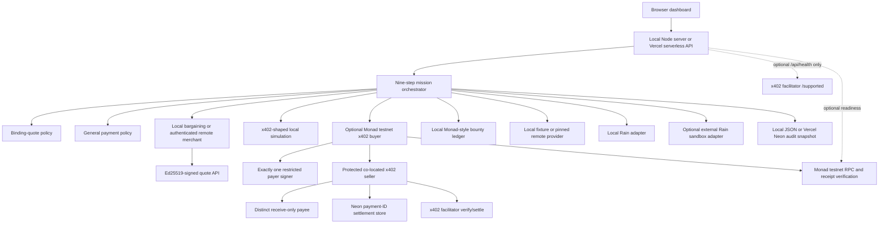

# Lazarus Mesh — Complete Project Guide

This document describes the code currently in the repository. It distinguishes mission accounting, the authenticated remote merchant/provider, local simulation, real cryptographic work, the armed Rain sandbox hybrid, and the exactly-one-signer one-shot Monad testnet Preview so demo claims remain accurate.

No secret, API-key, private-key, user-ID, team-ID, contract-ID, or card-data value belongs in this guide. Configuration is documented by environment-variable name only.

## 1. What the project is

Lazarus Mesh is a local-first demonstration of an autonomous recovery marketplace for legally authorized but unavailable digital artifacts. It can use either the bundled local fixture or the independently deployed merchant/provider at [https://lazarus-merchant.vercel.app](https://lazarus-merchant.vercel.app). The mission starts at zero seeders and demonstrates an agent that can:

1. buy availability intelligence through either an x402-shaped local simulation or an opt-in bounded Monad testnet x402 payment;
2. bargain with a merchant inside a deterministic policy envelope;
3. record and claim a demo recovery bounty in a local Monad-style ledger;
4. create narrowly scoped payment authority through either a local Rain adapter or the external Rain sandbox;
5. block unrelated spending and authorize only the accepted quote;
6. recover and hash-check 24 bundled pieces or eight authenticated remote-provider pieces;
7. reconstruct the original artifact and verify its SHA-256 commitment;
8. require a two-verifier quorum before reward release; and
9. restore two simulated seeders and retire payment authority.

The product thesis is **pay for verified recovery, not promises**. The agent can propose actions and counteroffers, but deterministic quote and payment policies decide whether money-like authority may be created or used.

Core local mission accounting can be selected in USD, EUR, GBP, CAD, or AUD using deterministic fixed reference values. The remote merchant accepts one configured currency at a time and is currently USD. This is not live foreign exchange or a claim that every external rail accepts every selected currency.

This is not a general torrent search engine, an unrestricted purchasing agent, a production card application, a wallet, an FX service, or a system for recovering unauthorized, copyrighted, private, malicious, or access-controlled material.

## 2. What is real, remote, and simulated

The implementation has three independent selectors. `ADAPTER_MODE` chooses local Rain or Rain sandbox. `MONAD_EXECUTION_MODE` chooses the x402-shaped local discovery adapter or the real capped Monad testnet x402 buyer. `MERCHANT_MODE` chooses the local Atlas fixture or authenticated remote merchant/provider. Deployment policy further constrains which combinations may run on Vercel.

| Capability | Local selection | External selection | Truthful status |
| --- | --- | --- | --- |
| Rain card/payment control | `ADAPTER_MODE=local` | `ADAPTER_MODE=rain-sandbox` makes authenticated Rain sandbox calls | Remote mode is still sandbox simulation, USD-only, and never a production card purchase |
| Merchant bargaining | Deterministic local Atlas merchant | Authenticated HTTPS merchant API | Remote binding quotes are Ed25519-signed and verified against a sponsor-pinned key |
| x402 discovery payment | `MONAD_EXECUTION_MODE=local` is x402-shaped simulation | `MONAD_EXECUTION_MODE=x402-testnet` signs and verifies a capped official test-USDC transfer | Public Production is local; testnet is restricted to a protected one-shot Preview or access-controlled local run |
| x402 availability seller | Disabled | Protected seller with facilitator settlement and Neon replay state | Co-located with the live Preview; disabled in public Production |
| Payer/payee wallets | None | Complete Privy server-wallet payer (preferred) or one dedicated low-value 32-byte raw key, plus a distinct receive-only payee | Protected Preview requires exactly one signer and needs no payee secret |
| Monad bounty lifecycle | In-memory local bounty ledger | No external implementation | Bounty receipt hashes are synthetic in every mode; the registry is not deployed/called |
| Monad/x402 network readiness | Optional read-only health probe | Same probe | Real reads when both origins are configured; probe success does not authorize payment |
| Artifact recovery | Reads and verifies a bundled 24-piece fixture | Authenticated eight-piece provider with sponsor-pinned manifest | Remote transfer and SHA-256/Merkle verification are real; persistent storage/reseeding are not |
| Verifier quorum | Scripted local identities | No external implementation | Simulated verifier independence |
| Reseeding | Mission state changes to two seeders | No external implementation | Simulated availability; no BitTorrent/IPFS seeding process starts |
| Local persistence | JSON audit snapshot plus in-memory adapter ledgers | Same | Local CLI persistence is not a durable external-operation journal |
| Vercel persistence | Free Neon Postgres JSONB snapshot | Preview also stores x402 settlement/replay records | Hybrid Production may call the remote merchant and Rain sandbox with isolated state; Preview uses isolated state and durable payment IDs |
| Solidity contract | Reference source only | No writer adapter | Not compiled, deployed, called, or audited by this application |

The most important runtime boundary is:

```text
Rain sandbox code can make authenticated sandbox calls and accepts USD missions only,
and the verified hybrid Production profile has exercised those calls with isolated state.
The protected Monad x402 Preview can move capped official test USDC using exactly one
complete signer. Buyer authorization is gasless; the submitting seller/facilitator uses MON.
The hybrid profile makes bargaining, provider retrieval, and Rain sandbox operations external.
The full Monad bounty, verifier logic, and reseeding remain local in every profile.
Public Vercel Production rejects live x402 and performs no chain write.
```

## 3. Architecture and trust boundaries



| Boundary | Responsibility |
| --- | --- |
| Agent/orchestrator | Advances a fixed mission, requests quotes, and proposes payment intents. It does not bypass validation. |
| Quote policy | Proves that the merchant response is binding, intact, current, in-session, in-budget, and term-compatible. |
| Payment policy | Revalidates the exact spend against rights, rail, merchant, MCC, purpose, count, amount, budget, expiry, approval, duplicate, and kill-switch rules. |
| Rain adapter | Creates and exercises narrow card-like authority. In hybrid mode, some controls are remote sandbox controls and others remain application controls. |
| Monad adapters | `LocalMonadAdapter` always models the bounty. `MonadX402Adapter` can independently pay only for discovery on testnet. |
| Payer signer | Complete Privy (preferred) or one dedicated 32-byte raw key; accepts only the pinned EIP-3009 typed-data envelope and verifies the returned signature. |
| x402 seller | Requires payment IDs, durably binds them to payment/resource fingerprints, settles through the facilitator, and replays exact successes without charging twice. |
| Vercel policy | Allows Rain sandbox in Production only with isolated state; rejects Production x402; allows live buyer/seller only on the protected branch Preview with one fixed local-fixture mission. |
| Currency policy | Keeps selected mission accounting separate from Rain USD/rUSD, x402 test USDC, and MON gas. |
| Recovery hashes | Verify local or remote bytes against piece hashes, a sponsor-pinned Merkle root, and a full-artifact SHA-256. |
| Verifiers | Supply the two passing attestations required by the local Monad adapter. Their independence is scripted, not decentralized. |

## 4. Requirements and run modes

The server requires Node.js 20 or later. It uses Node built-ins and browser-native JavaScript; there is no runtime dependency installation step.

### Local mode

```sh
node server.js
```

or:

```sh
npm run start
```

Open [http://127.0.0.1:4173](http://127.0.0.1:4173). The server is hard-bound to `127.0.0.1`; changing `PORT` changes only the port and does not expose the app to the LAN.

```sh
PORT=5000 node server.js
```

Local mode needs no secrets. By default it makes no payment or chain network calls. If both readiness origins are configured, requesting `/api/health` can still perform the optional read-only probe described later.

### Remote merchant/provider mode

`MERCHANT_MODE=remote` connects both bargaining and artifact delivery to [https://lazarus-merchant.vercel.app](https://lazarus-merchant.vercel.app). Requests use a server-side bearer token over HTTPS. Lazarus separately pins the merchant's Ed25519 fingerprint and a complete trusted artifact manifest; neither trust root is learned implicitly from the remote service.

The verified hybrid acceptance run used USD, completed two bargaining rounds, verified the signed `$9.75` quote, downloaded `8/8` pieces, and matched both the artifact hash and root. Rain's own ledger confirmed `$9.75` completed at MCC `5734` and the deliberate `$9.00` MCC `5944` challenge declined. Those are sandbox operations, so `$0.00` real money moved and there was no chain write. The bounty, verifier quorum, and reseeding remained local demo state.

The merchant console displays settings, negotiation sessions, counters, signed deals, and audit events. Lazarus includes proposed bounty metadata in the offer request, but the merchant currently does not persist it; the console has no financial bounty field, wallet, provider-claim control, or release history.

Remote configuration is server-side and uses these names:

```text
MERCHANT_MODE
LAZARUS_STATE_KEY
MERCHANT_BASE_URL
MERCHANT_API_TOKEN
MERCHANT_EXPECTED_KEY_ID
MERCHANT_CURRENCY
MERCHANT_TRUSTED_MANIFEST_JSON
MERCHANT_TIMEOUT_MS
MERCHANT_RESPONSE_LIMIT_BYTES
MERCHANT_MAXIMUM_PIECE_BYTES
MERCHANT_MAXIMUM_TOTAL_BYTES
```

The current remote deployment accepts one configured currency, USD. Local mode continues to support USD, EUR, GBP, CAD, and AUD. Remote mode cannot be combined with the protected one-shot `x402-testnet` Vercel profile; that profile requires the pinned local fixture.

### Rain sandbox hybrid mode

Set `ADAPTER_MODE=rain-sandbox`, provide the Rain sandbox environment variables described below, and start the same server:

```sh
ADAPTER_MODE=rain-sandbox node server.js
```

The application loads a repository-root `.env` file only when `server.js` is run as the main program. Existing process-environment values take precedence and are never overwritten by that loader. Tests normally inject configuration directly.

Only `local` and `rain-sandbox` are accepted. An unsupported `ADAPTER_MODE` fails startup; there is no silent fallback from sandbox to local execution.

Rain sandbox accepts USD mission accounting only. Use the local Rain adapter for EUR, GBP, CAD, or AUD demo accounting.

Rain sandbox is armed and verified. Authenticated health succeeds; the collateral/contract UUID was confirmed against the provider by control rather than guessed; and a full hybrid mission produced the completed and declined ledger entries described above. On Vercel, `ADAPTER_MODE=rain-sandbox` is allowed only with an explicit isolated `LAZARUS_STATE_KEY`. Keep the credential encrypted and server-side, rotate any disclosed value, and never guess or edit a provider identifier into a plausible UUID.

### Monad x402 testnet mode

Set `MONAD_EXECUTION_MODE=x402-testnet` only in an access-controlled local runtime or the explicitly armed Vercel branch Preview. Provide a dedicated low-value signer, credential-free HTTPS Monad RPC, a distinct receive-only payee address, and the protected x402 seller base URL:

```sh
MONAD_EXECUTION_MODE=x402-testnet node server.js
```

This can move official Monad test USDC. The EIP-3009 buyer authorization is gasless; the submitting seller/facilitator needs testnet MON for gas. It replaces only the availability-discovery adapter; the complete bounty registry remains local. An unsupported `MONAD_EXECUTION_MODE` fails startup.

Public Vercel Production rejects this mode and disables the seller. The protected branch Preview requires exactly one payer signer (complete Privy preferred or one dedicated low-value 32-byte raw key), a durable co-located seller, Vercel Deployment Protection, isolated `preview-*` state, exact one-cent price/cap, six confirmations, and the single bundled mission. Reset and arbitrary mission creation are disabled.

### Development and test commands

```sh
npm run dev
npm run test
npm run check
```

`npm run dev` uses Node watch mode. `npm run test` runs `node --test`. `npm run check` checks `server.js` syntax and then runs the full Node test suite.

## 5. Configuration reference

### Rain sandbox

| Variable | Required | Purpose |
| --- | --- | --- |
| `RAIN_API_BASE_URL` | Yes in hybrid mode | HTTPS base URL for the Rain sandbox API. |
| `RAIN_API_KEY` | Yes in hybrid mode | Server-side Rain API credential. It must never reach the browser, state, logs, or audit export. |
| `RAIN_USER_ID` | Yes in hybrid mode | Rain sandbox issuing-user UUID. |
| `RAIN_TEAM_ID` | Optional | Rain team UUID added to the health query when present. |
| `RAIN_CONTRACT_ID` | Yes in hybrid mode | Rain contract UUID used by the sandbox collateral-funding simulation. This is a Rain identifier, not a Monad bounty-contract deployment. |
| `RAIN_AUTO_FUND_MINOR` | Optional | Sandbox rUSD collateral amount simulated before first card creation. Set deliberately; `.env.example` defaults to `0`. |
| `RAIN_TIMEOUT_MS` | Optional | Rain request timeout. Default: `12000`; runtime clamps it to 1–30 seconds. |

The adapter validates the base URL as HTTPS, validates UUID-shaped identifiers, and rejects missing/too-short API credentials before it can run.

The verified deployment uses a provider-confirmed collateral UUID and has completed authenticated sandbox mutations. Rotate any credential disclosed in chat before continued use; do not replace the confirmed provider identifier with a guessed value.

### Monad and x402 configuration

| Variable | Current effect |
| --- | --- |
| `MONAD_EXECUTION_MODE` | `local` or `x402-testnet`; default `local`. |
| `MONAD_NETWORK` | Display/readiness label; default `eip155:10143`. The live adapter pins its own network. |
| `MONAD_CHAIN_ID` | Display/readiness metadata; default `10143`. The live adapter and probe independently require testnet. |
| `MONAD_RPC_URL` | Credential-free HTTPS origin for readiness and required live x402 chain/receipt checks. |
| `X402_FACILITATOR_URL` | HTTPS origin whose `/supported` endpoint is checked. The buyer does not call the facilitator directly. |
| `MONAD_PROBE_TIMEOUT_MS` | Readiness timeout; default `5000`. |
| `X402_AVAILABILITY_BASE_URL` | Required HTTPS seller directory for local testnet mode. Vercel derives the co-located Preview `/api/x402/availability/` URL from its protected host. |
| `PRIVY_APP_ID` | Privy server app identifier; all four Privy payer values are required together. |
| `PRIVY_APP_SECRET` | Encrypted server-side Privy secret; Preview/branch scope only. |
| `PRIVY_PAYER_WALLET_ID` | Dedicated low-value payer server-wallet ID; never returned to the browser. |
| `PRIVY_PAYER_ADDRESS` | Public payer address used to verify returned signatures. |
| `MONAD_PRIVATE_KEY` | Dedicated low-value 32-byte fallback. Configure either it or complete Privy, never both; protected Vercel Preview accepts either choice. |
| `MONAD_PAY_TO_ADDRESS` | Required distinct seller recipient in `x402-testnet`. |
| `X402_EXPECTED_AMOUNT_ATOMIC` | Exact test-USDC price; default `10000` atomic units, or test USDC 0.01. |
| `X402_MAX_PAYMENT_ATOMIC` | Payment cap; defaults to the expected amount and can never exceed 1 test USDC. |
| `X402_MAX_AUTHORIZATION_SECONDS` | Authorization-window ceiling; default `300`. |
| `X402_TIMEOUT_MS` | Seller/confirmation timeout; default `12000`. |
| `X402_PREFLIGHT_TTL_MS` | Verified-402 freshness window; default `60000`. |
| `X402_RESPONSE_LIMIT_BYTES` | Paid response limit; default `65536`. |
| `MONAD_X402_CONFIRMATIONS` | Required confirmations; default `6`. |
| `X402_EXPECTED_PROVIDER_ID` | Expected paid-result provider; default `provider_atlas_archive`. |
| `MONAD_BOUNTY_CONTRACT` | Readiness-presence metadata only; no writer uses it. |
| `MONAD_USDC_ADDRESS` | Readiness-presence metadata only; live x402 pins official test USDC in code. |
| `X402_SELLER_ENABLED` | Enables the durable seller only for protected Preview/local integration; Production keeps it false. |
| `ALLOW_EXTERNAL_WRITES_ON_VERCEL` | Explicit live-Preview arm; must remain false in Production. |
| `LIVE_PREVIEW_BRANCH` | Must exactly match Vercel's current Git branch. |
| `LAZARUS_STATE_KEY` | Local Production uses `primary`; remote Production requires an isolated `merchant-*` value; live Preview requires an isolated `preview-*` value. |

The network probe runs only if **both** `MONAD_RPC_URL` and `X402_FACILITATOR_URL` are configured. Setting only one does not perform a partial probe. Probe reads remain separate from execution. In `x402-testnet`, `writesEnabled` means the availability payment can write; `bountyWritesEnabled` remains false. The payee is receive-only: no payee private key belongs in configuration.

## 6. Default mission and economics

The default mission is **Restore the CC0 Rainfall Dataset**. It uses the bundled fixture at `fixtures/cc0-rainfall-dataset/rainfall-sample.json` and the corresponding CC0 declaration.

Mission accounting supports USD, EUR, GBP, CAD, and AUD. All money-like values are integer minor units of the selected currency. The fixed `lazarus-demo-reference-v1` values are 100 USD cents, 92 euro cents, 78 pence, 137 Canadian cents, and 152 Australian cents per reference USD. They are not live market FX rates. Required reserves/debits round up; maximums round down.

The table below is the USD reference story:

| Item | Default amount | Counted in `budget.spentMinor`? |
| --- | ---: | --- |
| x402 availability intelligence | `$0.01` | Yes |
| Merchant's initial archive ask | `$12.00` | No; it is an offer, not a purchase |
| Accepted archive quote | `$9.75` | Yes |
| Built-in unrelated challenge | `$9.00` | No; it is declined |
| Manual policy challenge | `$250.00` | No; it is declined |
| Recovery bounty | `$5.00` | No; tracked separately as the local reward/escrow model |
| Provider collateral requirement | `$2.00` | No; tracked separately in the local Monad ledger |
| Total mission budget | `$20.00` | External-spend ceiling |
| Successful external-style spend | `$9.76` | `1 + 975` minor units |

The `$5.00` reward is released cumulatively:

| Milestone | Cumulative | Incremental release |
| --- | ---: | ---: |
| Verified recovery | 70% | `$3.50` |
| Retained availability | 90% | `$1.00` more |
| Replication/completion | 100% | `$0.50` more |

New USD mission creation retains a conservative minimum recovery-service cap of `1201` cents: one cent of discovery reserve plus the USD 12.00 maximum bargaining ceiling. The deterministic USD run uses `976` cents after negotiation. The provider bounty is reported separately.

The server converts the reference reward and service-cap ranges into conservative currency-specific limits and publishes them under `system.missionCreation.currencyLimits`. It rejects rather than silently clamps invalid values. The provider bounty and service cap are separate commitments, and the UI shows maximum authorized exposure as their sum. The title is trimmed and capped at 100 characters. Every mission requires `rightsAttestation: true`, and unsupported currencies, content roots, piece counts, or licenses fail closed. Rain sandbox additionally requires USD. The form uses exactly one runtime-pinned artifact—the bundled local fixture or sponsor-pinned remote manifest—and does not ingest arbitrary uploads or roots.

See [Hackathon Acceptance and Currency Model](docs/HACKATHON_ACCEPTANCE_AND_CURRENCY.md) for the canonical accounting-versus-settlement matrix.

## 7. The complete nine-step behavior

The reusable state machine permits only forward transitions:

```text
DEAD
  -> DISCOVERING
  -> FUNDED
  -> RECOVERING
  -> VERIFYING
  -> VERIFIED
  -> RESEEDED
  -> COMPLETED
```

The orchestrator exposes nine actions because three recovery batches occur while the mission is in `RECOVERING`.

### Step 1 — discover availability, then bargain

- The selected x402 adapter creates or fetches a `402` requirement for the content root.
- Local mode returns an x402-shaped requirement and a synthetic 10,000-atomic test-USDC reference. It does not sign or move a token.
- `x402-testnet` requires a fresh x402 v2 exact requirement for official test USDC on `eip155:10143`, signs the capped authorization, and independently verifies the confirmed `Transfer` after the seller/facilitator settles it.
- Discovery records one modeled candidate provider, the configured local or remote provider, a 45-second estimate, the USD 12.00 reference estimate, and confidence `0.94`.
- Mission spend increases by the selected-currency equivalent of the one-cent reference. In testnet mode the chain settlement remains 10,000 test-USDC atomic units.
- **After discovery is complete, a separate negotiation session starts.** Local Atlas or the authenticated remote merchant uses the USD 12.00-to-USD 9.75 reference transcript. Remote mode verifies an Ed25519-signed binding quote.
- State becomes `DISCOVERING`, availability becomes `8`, and the event log explicitly says bargaining happened in a separate quote session.

### Step 2 — fund the recovery bounty

- The local Monad adapter creates a bounty keyed by mission and content root.
- The default reward and provider collateral use selected-currency equivalents of the USD 5.00 and USD 2.00 reference values.
- A synthetic confirmed receipt is added to the transaction list.
- State becomes `FUNDED` and availability becomes `12`.

No onchain bounty escrow is funded in any current mode. A testnet x402 payment in step 1 does not change that boundary.

### Step 3 — revalidate, claim, scope, challenge, and settle

- A binding quote is mandatory. Missing it fails with `BINDING_QUOTE_REQUIRED`.
- The quote policy runs again immediately before payment authority is created, catching expiry or mutation since step 1.
- The quote is converted into an exact payment policy: Rain card only, the quoted allowlisted merchant only, MCC `5734` only, purpose `archival_egress` only, the accepted amount/currency, one transaction, quote expiry, rights required, and the mission kill switch.
- The accepted quote is below the selected-currency equivalent of the USD 10.00 automatic negotiation approval threshold.
- The general payment policy performs a separate preflight.
- The local Monad adapter records the configured provider claiming the demo bounty and the selected-currency stake requirement. Only the initial non-settling bounty proposal is included in merchant offer context; claim and release records are not sent to the merchant console.
- Rain creates a scoped card tied to the mission and quote. It stores safe metadata only.
- The built-in challenge proposes an unrelated luxury purchase using the selected-currency equivalent of USD 9.00, merchant `merchant_luxury_market`, MCC `5944`, and purpose `unrelated_purchase`. It is deliberately within the amount ceiling so merchant/MCC/purpose scoping—not merely amount—blocks it.
- The exact quoted archival-egress purchase is authorized and settled locally by default or through Rain's sandbox for a USD hybrid mission.
- For the USD reference run, mission spend becomes `976` cents: USD 0.01 plus USD 9.75. Other currencies retain their own integer minor-unit totals.
- The negotiation state becomes `consumed`, preventing the quote from being treated as unused authority.
- State becomes `RECOVERING` and availability becomes `16`.

In hybrid mode the deliberate challenge also exercises Rain's remote MCC sandbox control. If Rain unexpectedly authorizes it, the adapter requests an immediate reversal and still returns a denied application result.

### Step 4 — recover the first batch

- Recovery obtains the first dynamic batch: local fixture bytes or authenticated remote-provider pieces.
- Each visible piece reports missing/recovered/verified progress and a short hash prefix.
- State remains `RECOVERING`, status text reports the actual batch and manifest total, and availability becomes `34`.

### Step 5 — recover the second batch

- Recovery advances through the second one-third milestone of the configured manifest.
- State remains `RECOVERING`, status text reports the actual count, and availability becomes `58`.

### Step 6 — recover and verify every piece

- Every configured piece is recovered: 24 locally or eight in the current remote deployment.
- Every piece is SHA-256 checked against its manifest descriptor.
- North and East, the first two scripted verifier identities, move to `passed`; West remains unused.
- Audit quorum becomes `2/2`.
- State becomes `VERIFYING` and availability becomes `82`.

### Step 7 — reconstruct, attest, and release 70%

- All verified pieces are concatenated in order.
- The reconstructed artifact SHA-256 must exactly equal the manifest's full-content SHA-256.
- The local Monad adapter records two unique passing verifier attestations.
- The recovery tranche releases the selected-currency reward to 70% cumulative (USD 3.50 in the reference mission).
- State becomes `VERIFIED`, `audit.rootMatched` becomes true, and availability becomes `94`.

### Step 8 — model retained availability and release to 90%

- The local Monad adapter releases the reward to 90% cumulative (USD 1.00 incremental in the reference mission).
- The mission records two seeders and moves the provider to `reseeding`.
- State becomes `RESEEDED` and availability becomes `100`.

The two seeders are mission-state simulation; the application does not start two network seeding processes.

### Step 9 — release the remainder and retire authority

- The local Monad adapter releases the final 10%, reaching 100% (USD 0.50 incremental in the reference mission).
- The provider becomes `completed`, the mission gets `completedAt`, and state becomes `COMPLETED`.
- In local mode, the Rain card becomes `retired` immediately.
- In Rain sandbox mode, local application authority is disabled and the card becomes `expiry_scheduled`; the remote card remains restricted by its short quote expiry because the public sandbox flow used here has no card-cancel operation.
- Final Rain and reconciliation events are added.

### Execution controls

- `step()` advances exactly one remaining step and is idempotent after step 9.
- `run()` advances all remaining steps with a presentation delay.
- A per-mission run lock returns a conflict for concurrent manual/run execution.
- Reset increments an internal generation counter. A pre-reset asynchronous run cannot save stale state over the new session.
- Each mission retains at most 100 events.

## 8. x402 discovery is not merchant bargaining

These are intentionally separate operations even though both occur in step 1.

| Operation | Question answered | Current adapter | Financial truth |
| --- | --- | --- | --- |
| x402 discovery | “Who may have this artifact, and what is the rough estimate?” | `LocalX402Adapter` or `MonadX402Adapter` | Local simulation, or an opt-in real test-USDC testnet transfer |
| Merchant negotiation | “What binding price and terms will the configured merchant accept?” | `LocalNegotiationAdapter` or `RemoteNegotiationAdapter` | Local transcript, or authenticated HTTPS plus an Ed25519-signed quote |

The x402 result's selected-currency equivalent of the USD 12.00 reference estimate is not a binding quote and cannot authorize Rain. Only the later merchant quote, after digest and policy validation, can become card scope.

The local x402 receipt is idempotent in memory for mission/content-root identity, and its transaction hash is synthetic. Configuring only `X402_FACILITATOR_URL` enables the optional `/supported` readiness check; live settlement requires `MONAD_EXECUTION_MODE=x402-testnet` plus the complete buyer/seller configuration. The live adapter builds, signs, validates, and encodes the authorization before creating durable state. It then stores the namespaced pending-payment record immediately before transmission. A signing/validation/persistence failure sends no paid request; an ambiguous post-transmission result leaves the gate in place, so reset, fresh startup, and another authorization fail closed. The protected seller durably enforces payment-ID uniqueness; production still requires operator reconciliation/clearance, horizontally safe locks, quotas, and normalized operation history.

## 9. Merchant bargaining

### Exact USD reference transcript

The reference economics are shared by local Atlas and the deployed Lazarus Recovery Merchant. The remote merchant/provider identities are allowlisted explicitly and the signature key is pinned.

| Sequence | Speaker | Action | Amount | Meaning |
| ---: | --- | --- | ---: | --- |
| Offer | Merchant | Initial ask | `$12.00` | Merchant starts at the configured maximum ceiling. |
| Round 1 | Buyer | Counter | `$9.00` | The mission's target price. |
| Round 1 | Merchant | Counter | `$10.50` | Deterministic midpoint between the current ask and buyer counter, bounded by its floor. |
| Round 2 | Buyer | Counter | `$9.75` | Best-within-policy midpoint between the target and seller counter. |
| Round 2 | Merchant | Accept | `$9.75` | The configured floor is met; remote mode issues an Ed25519-signed binding quote. |

The verified remote USD result saves `$2.25`, or `18.75%`, from the initial ask. The session uses two buyer counteroffer rounds. Mission policy allows up to three rounds, so the accepted result is within the limit. The current remote deployment accepts USD only; other currencies remain available in local mode or require coordinated remote reconfiguration.

### Exact accepted terms

```json
{
  "purchaseModel": "one_time",
  "service": "archival_egress",
  "autoRenewal": false,
  "dataSharing": false,
  "exclusivity": false
}
```

The remote quote is:

- for the allowlisted remote merchant and MCC `5734`;
- for the allowlisted remote provider;
- bound to the mission content root and `archival_egress` purpose;
- denominated in the mission's selected accounting currency and integer minor units;
- marked `binding: true`;
- issued with a 15-minute expiration; and
- committed by a canonical SHA-256 `quoteDigest`; and
- signed with the merchant's Ed25519 key, whose fingerprint is sponsor-pinned.

The adapters reject malformed identities, wrong provider/root/currency, invalid amounts, offer-session mismatch, finalized sessions, maximum-round violations, non-improving counters, malformed/oversized responses, key-pin mismatch, digest/signature failure, and unsupported terms.

Remote negotiation is a real structured API exchange, but it remains deterministic rather than generative. There is no free-form merchant chat or browser automation. The offer includes the proposed bounty as non-settling context, while the merchant console shows the session and signed deal but currently does not persist or display that bounty field.

### Negotiation API behavior

Step 1 runs bargaining automatically. `POST /api/missions/:id/negotiation` exists for explicit execution/replay after discovery:

- before step 1 it returns a conflict with `DISCOVERY_REQUIRED`;
- after an accepted or consumed quote it returns the same accepted quote state rather than bargaining again; and
- `GET` returns the mission's public negotiation record.

## 10. Binding-quote validation

`src/domain/negotiation-policy.js` is a fail-closed layer separate from the general spending policy. The quote is checked once when negotiation accepts it and again at step 3 before card creation.

The canonical digest commits to exactly these fields:

```text
quoteId, sessionId, merchantId, merchantName, providerId, mcc,
contentRoot, purpose, amountMinor, currency, terms, binding,
issuedAt, expiresAt
```

Validation checks, in order:

1. the response is explicitly binding;
2. it belongs to the expected negotiation session;
3. its recomputed canonical digest matches `quoteDigest`;
4. issued/expiry/current timestamps are valid and expiry is after issue;
5. the quote has not expired (`now >= expiresAt` is expired);
6. merchant ID is allowed;
7. MCC is allowed;
8. content root matches the mission;
9. purpose equals the required service;
10. currency is allowed;
11. amount is a positive safe integer;
12. amount is at or below the negotiation ceiling;
13. current spend plus quote fits the mission budget;
14. round count is at or below the limit;
15. the terms object has exactly the required keys and values; and
16. the quote is at or below the automatic approval threshold unless human approval is explicitly supplied.

Stable quote decision codes are:

```text
QUOTE_OK
QUOTE_NOT_BINDING
QUOTE_EXPIRED
QUOTE_INTEGRITY_MISMATCH
QUOTE_SESSION_MISMATCH
QUOTE_MERCHANT_NOT_ALLOWED
QUOTE_MCC_NOT_ALLOWED
QUOTE_RESOURCE_MISMATCH
QUOTE_PURPOSE_NOT_ALLOWED
QUOTE_CURRENCY_NOT_ALLOWED
QUOTE_AMOUNT_INVALID
QUOTE_CEILING_EXCEEDED
QUOTE_BUDGET_EXCEEDED
QUOTE_TERMS_NOT_ALLOWED
NEGOTIATION_ROUNDS_EXCEEDED
QUOTE_APPROVAL_REQUIRED
QUOTE_TIMESTAMP_INVALID
```

A valid quote is necessary but not sufficient: the exact payment intent must then pass `evaluatePolicy()`.

## 11. General payment policy

`src/domain/policy.js` evaluates one intent deterministically. It returns an immutable allowed/denied decision with a stable code rather than treating ordinary denials as exceptions.

Checks happen in this order:

1. kill switch;
2. mission active state;
3. valid current timestamp;
4. mission expiry;
5. policy expiry;
6. rights evidence;
7. blocked content hash;
8. duplicate intent/idempotency key;
9. allowed rail;
10. provider, merchant, recipient, MCC, and purpose restrictions;
11. transaction-count limit;
12. valid non-negative amount;
13. per-transaction limit;
14. aggregate budget limit; and
15. human-approval threshold.

Stable policy codes are:

```text
POLICY_OK
RIGHTS_EVIDENCE_REQUIRED
CONTENT_HASH_BLOCKED
MISSION_INACTIVE
MISSION_EXPIRED
POLICY_EXPIRED
PROVIDER_NOT_ALLOWED
MERCHANT_NOT_ALLOWED
RECIPIENT_NOT_ALLOWED
MCC_NOT_ALLOWED
PURPOSE_NOT_ALLOWED
RAIL_NOT_ALLOWED
TOO_MANY_TRANSACTIONS
PER_TRANSACTION_LIMIT_EXCEEDED
TOTAL_BUDGET_EXCEEDED
APPROVAL_REQUIRED
DUPLICATE_INTENT
KILL_SWITCH_ACTIVE
INVALID_AMOUNT
INVALID_TIMESTAMP
```

Limits are inclusive, approval is required only above the threshold, and expiry boundaries are exclusive (`now >= expiry` denies). The rail selector elsewhere in the domain prefers eligible x402/Monad service payments, then Rain card, then Rain payout, but the nine-step mission directly uses the adapters described above.

## 12. Rain integration

Rain is the conventional-commerce payment-control rail. It does not fund the recovery bounty and does not decide whether reconstructed bytes are valid.

### Local Rain adapter

`LocalRainAdapter` is entirely in memory. It creates card-like metadata containing:

- principal, mission, and quote IDs;
- merchant-ID and MCC allowlists;
- exact maximum amount;
- maximum transaction count;
- expiry and purpose;
- simulated last four digits; and
- active/retired state.

Authorization fails closed for a missing, inactive, expired, exhausted, oversized, wrong-merchant, or wrong-MCC purchase. A successful authorization increments the count. Scope arrays are copied and frozen so a caller cannot widen an already-created card.

No network call, card, bank balance, or money exists in this adapter. Local retirement is immediate.

### External Rain sandbox adapter

`RainSandboxAdapter` performs real authenticated HTTPS requests to Rain's sandbox, but those endpoints simulate issuing and transactions. It does not perform a production card payment or move real merchant funds.

Current request flow:

```text
GET  /issuing/transactions
POST /simulate/collateral/fund
POST /issuing/users/{userId}/cards/scoped
POST /simulate/transactions/authorize
POST /simulate/transactions/{transactionId}/settle
POST /simulate/transactions/{transactionId}/reverse
GET  /issuing/cards/{cardId}
```

The sponsor starter also lists Rain `/payment-routes` and `/simulate/payment-routes`. Lazarus does not implement or claim that separate cross-rail flow; the mission uses the scoped-card path above.

- The transactions query is the authenticated health check.
- Collateral funding simulates rUSD setup once before first card creation when auto-funding is nonzero.
- Scoped-card creation requests the exact accepted USD amount, quote expiry, and allowed MCCs. Rain may apply its sandbox authorization buffer to the remote ceiling; Lazarus application policy still permits only the exact accepted amount.
- The approved transaction is authorized and then settled; the settlement request sends an explicit `{ "amount": purchase.amountMinor }` JSON body because the current sandbox validator expects the optional amount to be present.
- Reversal is used only if the deliberate remote-control challenge unexpectedly authorizes.
- Card lookup reconciles safe status metadata.

### Rain request hardening

- The API key remains server-side in the `Api-Key` header.
- Card creation generates an encrypted `sessionid` with a pinned sandbox public key; transient plaintext secret buffers are zeroed after use.
- Idempotency keys are deterministic SHA-256 values and do not embed raw secrets.
- Requests use manual redirects and permit at most three same-origin redirects; cross-origin redirects are blocked.
- Timeout is bounded, and network errors, HTTP 429, and 5xx responses receive limited exponential-backoff retries.
- Provider failures are reduced to safe codes/messages instead of returning raw response bodies.
- UUID and response-shape validation fails closed.

### Rain enforcement split

The sandbox scoped-card endpoint used by this adapter directly receives amount, MCC, and expiry controls. It does not receive Lazarus merchant ID, content root, purpose, quote digest, or transaction-count policy.

| Control | Enforced by current application | Enforced by Rain sandbox call |
| --- | --- | --- |
| Exact `$9.75` binding quote | Yes | Amount ceiling is sent remotely |
| Merchant identity | Yes | Not represented in scoped-card creation |
| MCC `5734` | Yes | Yes |
| Quote expiry | Yes | Yes |
| One-transaction limit | Yes | Not represented in scoped-card creation |
| Purpose/content root/task scope | Yes | Not represented in scoped-card creation |
| Quote digest and accepted terms | Yes | No |

The application checks its policy before a normal remote authorization. The built-in unrelated-purchase demo deliberately allows the wrong-MCC attempt to reach Rain so the remote sandbox control is exercised too.

### Sensitive card-data handling

Rain's card-creation response may include encrypted PAN/CVC material. The adapter intentionally never copies those fields into its card object. They do not enter JSON state, SSE, audit export, browser code, or application logs. Only safe fields such as card ID, last four, status, scope, and timestamps are retained.

### Sandbox retirement and reset limitation

The public sandbox flow used here has no remote card-cancel call. At completion, the app:

1. disables local authority immediately;
2. records `expiry_scheduled`; and
3. relies on the binding quote's short remote expiry to end the remaining sandbox card lifetime.

Reset is blocked with `RAIN_SANDBOX_AUTHORITY_ACTIVE` while the running session records an unexpired Rain sandbox card as either `active` or `expiry_scheduled`. Completing the mission disables local use, but reset still waits for the recorded remote expiry because the sandbox exposes no cancel endpoint. A fresh hybrid startup uses the same rule and raises `RAIN_SANDBOX_AUTHORITY_UNRESOLVED` rather than forgetting remote authority. Repeated demos can consume sandbox card quotas.

## 13. Monad integration

Monad has two separate roles in the product story: a currently connected testnet x402 availability-payment path and a still-local bounty/collateral/verifier/reward model. It does not perform the Rain merchant charge.

### Bounty execution: local in every mode

`LocalMonadAdapter` is used for the full bounty lifecycle under every adapter combination. It implements:

- `createBounty()` — opens one bounty with sponsor, content root, reward, and stake requirement;
- `claimBounty()` — assigns the provider and marks the bounty claimed;
- `recordAttestations()` — validates up to 32 attestations and requires at least two unique passing verifier IDs; and
- `releaseTranche()` — moves reward release monotonically to a cumulative percentage from 1 to 100.

It labels receipts with chain ID `10143`, a local simulated block number, and a hash-shaped transaction ID, but also labels the network `local-monad-simulation`. It records selected mission currency separately from synthetic USDC settlement references so non-USD tranche totals reconcile. These receipts are not submitted to Monad, cannot be found in an explorer, and do not escrow tokens or native collateral.

The adapter rejects duplicate bounties, invalid claims, missing/nonpassing quorum, out-of-order releases, decreasing/duplicate percentages, and release before verification.

### Opt-in real x402 testnet payment

`MonadX402Adapter` is connected when `MONAD_EXECUTION_MODE=x402-testnet`. It handles only step-1 availability discovery. It pins Monad testnet `eip155:10143`, the official six-decimal test-USDC contract, the expected resource/provider/payee/amount, and bounded authorization/response/confirmation policy.

Before signing, it requires a fresh valid x402 v2 exact 402 response, verifies chain ID and payer balance, and requires the payment-identifier extension. It then signs one bounded EIP-3009 authorization, sends `PAYMENT-SIGNATURE` to the HTTPS seller, validates `PAYMENT-RESPONSE`, waits for confirmations, and independently verifies the exact official test-USDC `Transfer` from payer to the configured distinct payee.

The x402 seller is responsible for facilitator verify/settle calls, uses a settlement submitter that pays Monad gas, and enforces durable global uniqueness for the namespaced payment ID. The buyer may create an unused signature, but it persists the global pending-payment gate immediately before sending anything to the seller; only the successful durable state-write/CAS winner can transmit. An ambiguous paid-request outcome keeps that gate blocked until reconciliation. This mode can move test USDC, but the EIP-3009 authorization is gasless for the buyer. It is not mainnet or real-money production settlement.

The protected Preview completed transaction [`0x204f66f2cc3180e619babc9c341ddc71805ca8240a556d4665cf449bfb15300d`](https://testnet.monadscan.com/tx/0x204f66f2cc3180e619babc9c341ddc71805ca8240a556d4665cf449bfb15300d). Independent RPC checks confirmed chain `10143`, receipt success, and the exact 10,000-atomic (test USDC `0.01`) Transfer of the official Monad test-USDC token from the dedicated payer to the distinct payee. That run used the raw-key fallback and separately recorded the `$9.75` archive allocation in Rain's sandbox. The transaction proves paid discovery only; bounty, verifiers, and reseeding remained local.

### Exactly-one-signer payer and receive-only payee

The protected Preview accepts either `PrivyServerWalletSigner` (preferred) or one dedicated low-value 32-byte raw key. Exactly one signer type must be complete. The payer is funded only with the required test USDC. The payee is a different receive-only wallet; the application needs only its public address and never needs its private key or seed phrase.

When Privy is selected, a restrictive wallet policy is the custody-side control. Regardless of signer type, Lazarus independently permits only the exact `TransferWithAuthorization` schema, USDC name/version, Monad testnet, pinned token contract, configured payer/payee, capped positive amount, zero `validAfter`, short `validBefore`, and 32-byte nonce. Managed signing responses are bounded and sanitized, and every returned signature must verify against the payer address.

Privy configuration is all-or-nothing: its four payer variables must be present together. `MonadX402Adapter` and Vercel live policy accept either that complete signer object or one valid 32-byte raw key and reject both together.

### Protected durable seller

`MonadX402Seller` serves `GET /api/x402/availability/:contentRoot` only when explicitly enabled. It advertises one x402 v2 exact Monad-testnet USDC requirement, requires the payment-identifier extension, verifies/settles through the configured facilitator, and returns deterministic provider-availability metadata.

`NeonX402SettlementStore` reserves each payment ID before settlement and binds it to a payment fingerprint and content root. The protected Preview derives the buyer's payment-ID namespace from its isolated state key, preventing deliberate new preview cycles from colliding in this global seller table. An exact settled replay returns the stored response and settlement header without another charge. Another payload/resource using the same ID conflicts. Processing or uncertain results stop with reconciliation required. If settlement may have succeeded but the replay record cannot be saved, the seller marks the outcome uncertain instead of pretending success.

In the protected Vercel Preview, buyer and seller are co-located. The buyer uses an internal same-origin transport so it does not bypass Vercel Deployment Protection by calling the external preview URL. The HTTP seller route remains behind the same protection for protocol inspection. Public Production disables both buyer and seller.

### Vercel one-shot policy

The live Preview starts only when Vercel environment/target are Preview, the branch matches the explicit allowlist, external writes are armed, state uses a unique `preview-*` key, amount and cap are exactly 10,000 atomic test-USDC units, authorization is at most 300 seconds, confirmations are at least six, and exactly one payer signer is valid (complete Privy preferred or one dedicated low-value 32-byte raw key).

Request hosts must match Vercel's deployment/branch hosts, and persisted state must contain only the bundled demo mission. The immutable mission uses a 30-day preview lifetime instead of the normal one-hour local session. Reset and mission creation return `LIVE_PREVIEW_ONE_SHOT`. Only one unresolved buyer payment is allowed across the state.

### Optional read-only readiness probe

`src/services/monad-network.js` is not an execution adapter. `/api/health` calls it only when both the RPC and facilitator origins are configured.

The probe performs two reads in parallel:

1. a JSON-RPC `eth_chainId` call, which must report Monad testnet chain `10143`; and
2. `GET /supported` on the facilitator, which must advertise x402 version 2, the `exact` scheme, and `eip155:10143`.

Probe hardening includes:

- HTTPS origins only;
- no username, password, path, query, or fragment in configured origins;
- manual same-origin redirects only, with unsafe POST redirect changes blocked;
- a maximum of three redirects;
- timeouts that include response-body reading;
- a 64 KiB maximum response;
- strict JSON/chain/support validation; and
- sanitized public error codes.

If both origins are configured and either check fails, `/api/health` returns HTTP 503. If the pair is not configured, the probe reports `configured: false` and does not make overall health fail.

### What is still required for a live Monad bounty

The connected x402 write path does not make `RecoveryBountyRegistry.sol` live. A real bounty would still require:

- compilation, tests, fuzzing, audit, deployment, and verified bytecode;
- a dedicated bounty-writer/custody boundary separate from the x402 payer;
- reward-token funding and allowance, provider addresses, verifier authorization/signatures, and native MON collateral;
- exact mapping to the contract's real lifecycle, deadlines, disputes, retention epochs, replication, and pull-based collateral return;
- call simulation, nonce/fee policy, confirmed receipts, replacement/reorg handling, and restart reconciliation; and
- normalized durable mission/operation/idempotency state.

Health therefore distinguishes `x402PaymentWritesEnabled` from `bountyWritesEnabled`. The latter is always false. `MONAD_BOUNTY_CONTRACT` remains only a configuration-presence signal.

## 14. Solidity reference contract

`contracts/RecoveryBountyRegistry.sol` is an unaudited future integration reference using Solidity `^0.8.24`. The JavaScript application does not compile, deploy, import, or call it.

The reference models:

- a fixed ERC-20 reward token;
- native-currency provider collateral;
- mission creation, claim, verification, retention, dispute, expiry, and completion phases;
- an owner-managed pause and verifier allowlist;
- EIP-712 typed verifier attestations, signer/nonce/digest replay protection, and one vote per verifier per checkpoint;
- recovery, availability, and replication evidence stages;
- 70%, 20%, and 10% reward tranches, including rounding remainder;
- dispute resolution and deadline-based expiry; and
- credit-and-withdraw native collateral payouts.

A contract cannot itself inspect off-chain files or prove seeder independence. Even a future deployment would still depend on a defensible verifier/oracle design. Do not use this reference with real value without compilation tests, unit/invariant/fuzz testing, deployment scripts, external audit, and governance review.

## 15. Recovery and integrity engine

`LocalRecoveryAdapter` and `RemoteRecoveryAdapter` handle actual content bytes.

It:

1. reads the bundled JSON fixture;
2. splits it into 24 ordered byte ranges;
3. calculates SHA-256 for each range;
4. builds a binary Merkle tree, duplicating an odd final node when necessary;
5. calculates the full artifact SHA-256;
6. normalizes and fully validates the manifest before starting a session;
7. releases real local piece buffers in three batches;
8. verifies recovered piece hashes;
9. reconstructs only after every piece is verified; and
10. compares the reconstructed full SHA-256 with the manifest commitment.

Manifest normalization checks digest shape, piece ordering, byte lengths, count consistency, piece data, total bytes, artifact hash, and Merkle root. Corruption fails with a piece/hash or reconstruction error.

Internal `_source` and `_pieceBytes` values are required for the local fixture engine but are stripped from every public state response by the orchestrator's recursive serializer.

Remote mode takes a complete sponsor-pinned manifest from server-side configuration, fetches the provider's manifest over authenticated HTTPS, and requires exact equality before accepting any piece. It bounds JSON, per-piece, and aggregate bytes; verifies piece ordering, sizes, hashes, Merkle root, and reconstructed artifact SHA-256; and safely re-fetches the recorded prefix when a serverless request rehydrates. The current provider manifest contains eight pieces, and the acceptance run verified all `8/8`.

This is real remote transfer and integrity verification, not a durable recovery network. There is no BitTorrent DHT/tracker, IPFS, malware scanner, sandboxed content processor, independent verifier, durable replica host, or independent reseeding service.

## 16. State and audit model

Top-level state uses `schemaVersion: 4`, an immutable runtime-binding marker, one active mission ID, system truth metadata, and a mission array.

Important mission fields:

| Field | Meaning |
| --- | --- |
| `id`, `title`, `objective` | Mission identity and goal. |
| `status`, `statusLabel`, `stepIndex`, `running` | Canonical lifecycle and execution state. |
| `principal`, `provider`, `verifiers` | Scripted demo identities and their progress. |
| `rightsEvidence`, `deadline` | Rights basis and mission expiry. |
| `manifest`, `contentRoot`, `pieces` | Public integrity commitment and piece progress. |
| `availability`, `seeders` | Presentation availability score and simulated seeder count. |
| `budget` | Total, external spend, reward, released reward, and provider stake in minor units. |
| `policy` | Original mission rights, merchant, MCC, limit, expiry, rail, approval, and kill-switch envelope. |
| `negotiation` | Target/ceiling, allowed merchant/MCC/currency, exact terms, offers, rounds, accepted quote, decision, savings, and consumption state. |
| `rainCard` | Safe local/sandbox card metadata; never PAN/CVC. |
| `payments`, `transactions` | x402, Rain, and local Monad receipts. |
| `policyDecisions` | Explicit allowed/denied policy records. |
| `audit` | Expected/reconstructed SHA-256, root match, and verifier quorum. |
| `events` | Newest-first timeline capped at 100 records. |

`src/store.js` writes `.data/state.json` through a temporary file and rename. Invalid stored JSON is copied to a timestamped `.invalid-*` backup before fresh state is created.

Ordinary local server startup replaces stored state with a fresh coherent session because the demo ledgers are ephemeral. It fails closed before replacement when the snapshot contains either (a) an unexpired Rain sandbox card or (b) an unresolved Monad x402 pending-payment record. Rain authority raises `RAIN_SANDBOX_AUTHORITY_UNRESOLVED`; pending x402 raises `X402_RECONCILIATION_REQUIRED`. Reconcile the external state before starting a fresh session.

Step 3 also checkpoints the snapshot immediately after external card creation, after the deliberate Rain challenge, and after the approved Rain settlement. These intermediate saves preserve the known external authority and transaction receipts if a later network operation or process interruption prevents the whole step from completing. Final spend, negotiation-consumption, lifecycle, and event accounting is saved when the step completes.

These safeguards improve sandbox/testnet reconciliation, but `.data/state.json` is still an audit/debug snapshot rather than general crash-safe workflow resumption or an authoritative financial ledger. The live x402 buyer durably writes its pending record immediately before paid transmission and restores that block after reconstruction.

The protected seller uses a separate Neon table for durable payment-ID/fingerprint/content-root/status/result/settlement records. This provides exact-replay idempotency and explicit uncertain outcomes for the one-shot Preview; it does not replace an operator reconciliation/clearance workflow or normalized production operation history.

The export endpoint returns a formatted mission audit containing the public mission, negotiation transcript, policy decisions, receipts, verifier state, and reconstruction result. It is locally useful but not tamper-proof because the same process controls state, adapters, and export.

## 17. HTTP API

| Method | Route | Behavior |
| --- | --- | --- |
| `GET` | `/api/health` | Reports runtime truth, Rain health, local/testnet execution status, and optional Monad/x402 readiness. Returns 503 when a configured external health dependency fails. |
| `GET` | `/api/state` | Returns recursively sanitized public application state. |
| `GET` | `/api/events` | Opens an SSE stream and immediately emits the current public state; later mutations broadcast new state events. |
| `GET` | `/api/x402/availability/:contentRoot` | Protected paid availability seller route; disabled in public Production. |
| `POST` | `/api/demo/reset` | Resets local state; blocked by unresolved authority and disabled in the one-shot Preview. |
| `POST` | `/api/missions` | Creates a bundled-fixture mission after validation; disabled in the one-shot Preview. |
| `POST` | `/api/missions/:id/step` | Executes the next of nine actions. |
| `POST` | `/api/missions/:id/run` | Runs every remaining action with a demo delay. |
| `GET` | `/api/missions/:id/negotiation` | Reads the public negotiation record. |
| `POST` | `/api/missions/:id/negotiation` | Executes or idempotently replays negotiation after discovery. |
| `POST` | `/api/missions/:id/blocked-purchase` | Exercises an additional `$250.00` unapproved purchase after card creation. |
| `GET` | `/api/missions/:id/export` | Downloads the mission as formatted audit JSON. |

### Health response truth

- `system.mode` is `local` or `hybrid-sandbox`.
- Rain reports local/sandbox mode, external status, and authenticated health without returning credential values.
- In local x402 mode, Monad reports `local-ledger`, x402 reports `local-handshake`, and both write flags are false.
- In `x402-testnet`, Monad reports `testnet-x402-plus-local-bounty`, x402 reports `monad-testnet`, `x402PaymentWritesEnabled` is true, and `bountyWritesEnabled` remains false.
- Negotiation reports local mode.
- Recovery reports `verified-local-fixture`.
- Configuration is exposed only as booleans such as `signerConfigured`, never raw values.
- x402 health separately reports whether the protected seller is enabled.
- Production reports a local buyer and disabled seller; protected Preview reports the testnet buyer plus seller while bounty writes remain false.

### Manual blocked-purchase endpoint

The built-in step-3 challenge is deliberately `$9.00` and within the quote ceiling to show merchant/MCC/purpose enforcement. The separate endpoint submits `$250.00`, MCC `7995`, and an unapproved merchant after a card exists; its first applicable local card denial is normally the amount ceiling. Both are audit demonstrations and never add to successful spend.

### Error behavior

- Missing missions return 404.
- Concurrent mission execution and invalid step prerequisites return 409.
- Rights/budget/quote/config validation uses 4xx responses where applicable.
- Oversized request bodies return 413.
- Unmatched API routes return 404; unsupported static methods return 405.
- Unhandled route errors return a safe message plus an `X-Request-Id`/JSON `requestId` for correlation.

## 18. Browser dashboard

The UI is static HTML, CSS, and dependency-free JavaScript:

- `public/index.html` supplies semantic structure, controls, form/dialog, tab roles, live regions, and accessible labels.
- `public/styles.css` supplies the responsive desktop/mobile layout and dark/light visual system.
- `public/app.js` normalizes state, calls the API, renders the mission, subscribes to SSE, falls back to polling, exports audits, manages theme preference, and reports accessible notices.

Main areas:

| Area | Behavior |
| --- | --- |
| Top environment bar | Distinguishes local from hybrid sandbox/testnet operation and truth-labels external payment capability. |
| Mission sidebar | Lists and selects missions and opens mission creation with USD/EUR/GBP/CAD/AUD accounting. |
| Mission header | Shows status/root and exposes run, step, challenge, export, and reset controls. |
| Lifecycle | Compresses eight internal statuses into five presentation stages: Dead, Discovering, Recovering, Verified, and Reseeded. `FUNDED` folds into Discovering, `VERIFYING` into Recovering, and `COMPLETED` into Reseeded. |
| Metrics/piece map | Shows availability, recovered/verified pieces, seeders, remaining budget, and every configured piece (`24` local or `8` current remote). |
| Payment rails | Shows latest safe Rain, local bounty, and local or confirmed testnet x402 receipts. |
| Timeline | Shows newest mission events received through SSE. |
| Receipts tab | Displays payment/transaction evidence. |
| Deal tab | Displays ask, accepted price, savings, rounds, exact transcript, accepted terms, quote/session IDs, expiry, and quote-policy decision. |
| Verifiers tab | Displays verifier states and quorum. |
| Policy tab | Displays bounded mission and spending-policy details. |

The client escapes server-provided HTML values before rendering, supports keyboard movement across audit tabs, uses ARIA live regions and progress semantics, remembers theme in local storage when available, and polls `/api/state` every five seconds if SSE is unavailable or reconnecting.

The mission form displays the server-published content root, license, and piece count for exactly one runtime-pinned artifact: the bundled local fixture or sponsor-pinned remote manifest. Arbitrary uploads and roots remain rejected. It displays the fixed-reference-rate disclaimer and rejects non-USD currency while Rain sandbox is selected.

## 19. Server and integration security

### Local HTTP boundary

- The server binds only to `127.0.0.1`.
- Every request validates the `Host` header against `127.0.0.1`, `localhost`, or `::1`, blocking DNS-rebinding-style access.
- POST requests reject `Sec-Fetch-Site: cross-site` and mismatched `Origin` hosts.
- JSON bodies are limited to 1 MB and must parse cleanly.
- Static files are resolved only under `public/`; decoded path traversal is blocked.
- Headers include no-store caching, MIME sniffing prevention, frame denial, no-referrer policy, and a restrictive Content Security Policy.
- Public-state serialization strips every property whose key begins with `_`.

This is defense in depth for a loopback demo, not user authentication. The app has no accounts, sessions, CSRF token, authorization roles, TLS termination, rate limiting, durable audit signing, or multi-tenant isolation and must not be exposed as a production service.

The Vercel Preview instead relies on Vercel Deployment Protection for access control, plus exact branch/host/environment checks and the one-shot state gate. Host checks are not authentication. Public Production contains no payer signer. Rain secrets are allowed only for the isolated-state sandbox hybrid.

### Secrets and payment data

- Secrets remain server-side environment values.
- Raw credentials are never returned from health or system state.
- Rain encrypted PAN/CVC fields are discarded rather than transformed or persisted.
- Provider response bodies and configured origins are not exposed as credential-bearing errors.
- Private keys, API keys, card material, and raw recovery bytes must never be added to browser JavaScript, SSE, audit JSON, logs, model prompts, or blockchain calldata.
- `.env` must remain ignored and uncommitted; use `.env.example` only for variable names/placeholders.
- Every payer signer secret is a branch-scoped server value. Privy app secrets/wallet IDs and raw payer keys never enter state or browser code.
- The payee is receive-only and needs no stored private key.
- Vercel live Preview accepts exactly one signer: complete Privy (preferred) or a dedicated 32-byte `MONAD_PRIVATE_KEY`; both together fail closed.

Credentials accidentally disclosed outside the repository should be rotated at their provider. Merely omitting them from documentation does not revoke them.

## 20. Failure modes and operational behavior

| Failure | Current behavior |
| --- | --- |
| Unsupported adapter mode | Startup throws; no fallback. |
| Invalid/missing Rain sandbox configuration | Hybrid startup throws `RAIN_INVALID_CONFIGURATION`. |
| Rotated/invalid Rain configuration | Startup or authenticated health fails closed; never guess or transform a provider-issued identifier. |
| Rain authentication/provider/network failure | Health returns 503 or the mission action fails with a sanitized Rain error; limited retries apply only to retryable failures. |
| Configured Monad RPC/facilitator readiness mismatch | Health returns 503 when the paired readiness probe is configured; bounty execution remains local. |
| Invalid/missing live x402 configuration | `x402-testnet` startup fails closed; no local fallback. |
| Wrong x402 chain/token/payee/resource/amount/window/provider | Discovery/payment fails before or after signing with a stable x402 error; no alternative requirement is accepted. |
| Insufficient test USDC | Payment fails before signing. |
| Ambiguous x402 paid response/timeout | Outcome is marked unknown and must be reconciled by stable payment ID before retry; a blind automatic retry is refused. |
| Invalid/unconfirmed Monad receipt | The payment is not represented as settled; operator reconciliation is required when funds may have moved. |
| Privy typed data outside policy | Rejected before a signing request; no signature is produced. |
| Invalid Privy response/signature | Sanitized failure; mismatched signature is rejected. |
| Vercel live mode on Production/wrong branch/host/state/key | Runtime or request fails closed with a stable Vercel live-mode denial. |
| Preview reset or mission creation | Rejected with `LIVE_PREVIEW_ONE_SHOT`. |
| Seller payment-ID replay | Exact settled replay returns stored result; conflict/processing/uncertain state stops. |
| Only one Monad probe origin configured | Probe does not run; health reports the network check unconfigured. |
| Discovery not completed | Explicit negotiation returns `DISCOVERY_REQUIRED`. |
| No binding quote | Step 3 returns `BINDING_QUOTE_REQUIRED`. |
| Quote expired, mutated, over budget, wrong terms, or wrong scope | Quote policy denies with a stable `QUOTE_*` code before card creation/use. |
| Payment violates rights/rail/merchant/MCC/purpose/amount/count/budget/approval/kill switch | General policy or Rain card denies with a stable reason; declined charges do not increase spend. |
| Duplicate/local Monad lifecycle call | Adapter rejects invalid bounty, claim, attestation, or tranche state. |
| Piece or artifact corruption | Piece verification or reconstruction throws; reward release does not proceed. |
| Concurrent run/step | Conflict response; one active run per mission. |
| Reset during a local run | Generation cancellation prevents stale state from overwriting reset state. |
| Reset with unexpired sandbox card | Blocked with `RAIN_SANDBOX_AUTHORITY_ACTIVE` for both `active` and `expiry_scheduled` state. |
| Sandbox completion | Local authority is disabled, but remote cancellation is unavailable; expiry is scheduled. |
| Malformed/oversized API input | 400/413 response; server stays running. |
| Corrupt JSON snapshot | Store creates an `.invalid-*` backup and fresh state. |
| Server restart | Normally starts a fresh mission because in-memory ledgers cannot be rehydrated. Hybrid startup instead refuses with `RAIN_SANDBOX_AUTHORITY_UNRESOLVED` while the prior snapshot contains an unexpired `active` or `expiry_scheduled` Rain sandbox card. |

There is no distributed transaction across Rain, x402, and application state. Card creation, the deliberate Rain challenge, and approved Rain settlement are checkpointed as soon as each external mutation returns, while the x402 buyer durably records stable pending identity immediately before transmission and the seller durably reserves payment IDs. A later crash or ambiguous response may still require reconciliation rather than rollback. An operator clearance workflow, normalized operation history, horizontally safe seller locks, receipt reconciliation, webhook handling, and explicit recovery jobs are required before production use.

## 21. Tests and QA

The Node suite covers local behavior and uses injected/fake network clients for sandbox/testnet boundaries:

| Test file | Coverage |
| --- | --- |
| `tests/domain.test.js` | General policy boundaries/codes, transitions, canonical hashes, manifests, corruption, simulation, and rail selection. |
| `tests/currency.test.js` | Explicit currency catalog, conservative conversion/rounding, and rejection of settlement assets as mission currencies. |
| `tests/integration.test.js` | Full nine-step HTTP run, negotiation routes, exact economics, audit export, validation, reset/run safety, origin/Host/body protections, and state truth. |
| `tests/handler.test.js` | Serverless preflight guards, one-shot capabilities, x402 pending-state safety, and separate x402-vs-bounty write metadata. |
| `tests/merchant-remote.test.js` | Signed remote bargaining, pinned eight-piece recovery, and the combined remote-merchant/provider plus Rain sandbox workflow across request-local rehydration. |
| `tests/negotiation.test.js` | Two-round transcript, binding quote/digest, idempotency, cloning, failure cases, and quote-policy denial matrix. |
| `tests/rain-sandbox.test.js` | Rain endpoint/header/body mapping, idempotency, encrypted-session use, PAN/CVC redaction, authorization plus explicit-amount settlement, local merchant denial, remote MCC decline, expiry-scheduled retirement, and malformed-UUID rejection. |
| `tests/monad-network.test.js` | Chain/facilitator readiness, strict origins, redirect safety, response limits, timeouts, and sanitized failures. |
| `tests/services.test.js` | Local Rain scope, local Monad quorum/tranches, local x402 idempotency, and exact fixture reconstruction. |
| `tests/x402-monad.test.js` | x402 v2 requirement validation, bounded signing, payment identifiers, receipt/transfer verification, wrong-policy cases, balance checks, and unknown outcomes using fakes. |
| `tests/x402-internal-fetch.test.js` | Same-origin seller routing, abort/timeout behavior, listener cleanup, and safe handling of late seller outcomes. |
| `tests/privy-signer.test.js` | Privy typed-data allowlist, request shape, secret redaction, returned-signature verification, and all-or-nothing configuration. |
| `tests/x402-seller.test.js` | Protected seller requirements, durable payment-ID semantics, settlement/replay/conflict/uncertain outcomes, and buyer/seller protocol compatibility. |
| `tests/vercel-policy.test.js` | Production denial, protected Preview arming, branch/host/state controls, one-shot behavior, and exactly-one-signer acceptance/rejection. |
| `tests/state-migrations.test.js` | Runtime-state migration and preservation of external-vs-synthetic evidence. |

```sh
node --test
```

The automated suite uses injected fake network functions/clients for Rain, readiness, and x402 tests. It does not require secrets, move tokens, or contact Rain, Monad, a seller, or a facilitator.

`qa/browser-qa.cjs` is a Playwright-driven browser QA script with checked-in desktop/mobile captures. It validates dashboard behavior and overflow and writes screenshots/audit artifacts. Its browser executable configuration is environment-specific, so it may need local adjustment before running on another machine.

## 22. Repository map

```text
server.js
  Loopback HTTP server, adapter selection, health checks, REST/SSE routes,
  request security, static serving, and runtime truth metadata.

src/config.js
  Minimal .env loader plus Rain, Monad/x402, and Privy-signer mapping.

src/vercel-policy.js
  Public-Production and one-shot protected-Preview execution policy.

src/orchestrator.js
  Nine-step workflow, bargaining orchestration, quote/payment gates, run locks,
  reset generation safety, audit events, and public-state sanitization.

src/demo-state.js
  Default mission, fixture manifest, economics, negotiation envelope, policies,
  scripted identities, initial audit record, and system state factory.

src/store.js
  Atomic-style local JSON snapshot writes and invalid-file backup behavior.

src/domain/canonical.js
  Deterministic object serialization and SHA-256 commitments.

src/domain/currency.js
  Fixed demo accounting currencies, conservative integer conversions, and
  the public rate-set description.

src/domain/manifest.js
  Deterministic synthetic manifest helpers used by domain tests.

src/domain/negotiation-policy.js
  Quote digest field set and fail-closed binding-quote validation.

src/domain/policy.js
  General deterministic spending policy and stable decision codes.

src/domain/rail.js
  Deterministic x402/Rain payment-rail preference logic.

src/domain/state-machine.js
  Canonical lifecycle and forward-transition enforcement.

src/domain/simulation.js
  Lightweight immutable recovery scenes used for deterministic replay/tests;
  not the HTTP orchestrator.

src/domain/index.js
  Domain-module exports.

src/lib/ids.js
  Local deterministic IDs, SHA helpers, and transaction-shaped hashes.

src/services/negotiation-local.js
  Deterministic Atlas offer/counter/quote state machine.

src/services/x402-local.js
  x402-shaped local availability requirement and synthetic receipt.

src/services/x402-monad.js
  Opt-in bounded x402 v2 buyer for official test USDC on Monad testnet,
  including payment-ID, policy, balance, and receipt-log verification.

src/services/x402-internal-fetch.js
  Preview-only origin/path-restricted in-process transport from the buyer to
  its co-located protected seller.

src/services/privy-signer.js
  Privy server-wallet adapter with a strict EIP-3009 typed-data allowlist and
  returned-signature verification.

src/services/x402-seller.js
  Protected x402 availability seller using the facilitator and required
  payment-identifier extension.

src/services/x402-seller-store.js
  Durable Neon settlement/replay store plus test-only memory implementation.

src/services/rain-local.js
  In-memory scoped-card creation, authorization, and retirement.

src/services/rain-sandbox.js
  External Rain sandbox API adapter, safe response handling, retries,
  settlement/reversal, and expiry-scheduled retirement.

src/services/monad-local.js
  In-memory bounty, claim, quorum, and cumulative reward ledger.

src/services/monad-network.js
  Optional read-only Monad chain and x402 facilitator readiness probe.

src/services/recovery-local.js
  Real fixture-byte splitting, manifest normalization, piece verification,
  Merkle calculation, and reconstruction.

public/index.html
public/styles.css
public/app.js
public/favicon.svg
  Dependency-free responsive dashboard.

fixtures/cc0-rainfall-dataset/
  Bundled demonstration data and CC0 license declaration.

contracts/RecoveryBountyRegistry.sol
contracts/README.md
  Future Monad contract reference and warnings; not deployed or invoked.

tests/
  Domain, service, negotiation, Rain sandbox, network-probe, and HTTP tests.

docs/API_INTEGRATION.md
  Exact current integration modes, variables, endpoint behavior, and security.

docs/HACKATHON_ACCEPTANCE_AND_CURRENCY.md
  Canonical hackathon acceptance, accounting, settlement, and deployment matrix.

docs/DEMO_SCRIPT.md
  Short presentation flow.

qa/
  Browser QA driver and reference desktop/mobile captures.

README.md
  Quick start and concise current-mode summary.

PROJECT_GUIDE.md
  This exhaustive implementation guide.

LAZARUS_MESH_MASTER_PLAN.md
RAIN_MONAD_DOSSIER.md
HACKATHON_BUILD_BRIEF.md
  Product architecture, sponsor research, and earlier planning context. These
  may describe future possibilities beyond the shipped runtime.

tmp/pdfs/
  Derived reference-document render used during project analysis; not runtime.
```

## 23. What would make it fully live

### Live merchant bargaining

The authenticated `RemoteNegotiationAdapter` and signed merchant quote flow already exist. Productionizing them still requires tenant identity, formal key rotation, durable quote/payment reconciliation, rate limits, abuse monitoring, cancellation, legal term normalization, and human escalation when terms leave the approved envelope. An LLM may draft language, but deterministic policy must remain the authority.

### Production x402 settlement

The capped testnet buyer already validates version/scheme, network, official token, amount, recipient, resource, authorization window, payment identifier, seller settlement response, and exact confirmed transfer, and durably records the pending operation immediately before paid transmission. The protected seller adds durable payment-ID reservation and replay. Production still requires managed custody, a reviewed operator reconciliation/clearance workflow, horizontally safe locks, quotas, abuse controls, monitoring, incident response, and a reviewed mainnet/token/facilitator policy. Public Vercel Production remains x402-local even when the Rain sandbox hybrid is enabled.

### Live Monad bounty execution

Compile, test, audit, and deploy the contract; implement a separate writer adapter; fund and approve the reward token; simulate each transaction; verify chain ID and contract code; wait for confirmed receipts; handle nonce races, reorgs, timeouts, replacement transactions, disputes, and restart reconciliation. Do not reuse the local synthetic receipt hashes as if they were chain transactions.

### Production Rain

Move beyond sandbox simulation only after confirming production API contracts, issuer/compliance requirements, merchant/MCC behavior, webhooks, signed events, reversal/dispute semantics, card cancellation, quotas, and secure card-data handling. Keep application quote policy even where Rain adds more remote controls.

The sandbox path is armed and provider-verified. Keep its credential encrypted and server-side, rotate any value disclosed outside a secret manager, retain the provider-validated UUID exactly, and preserve fail-closed configuration validation.

### Production multi-currency

Replace fixed demo references with an approved rate source and define rate locks, spread/fees, rounding, provider-supported issuing/settlement currencies, treasury/custody, disclosures, refunds, disputes, accounting, tax, and reconciliation. Do not infer a multi-currency card product from the current accounting selector.

### Real recovery and verification

Add isolated retrieval workers for approved sources, malware/content scanning, arbitrary signed manifest ingestion, resource limits, independent verifier infrastructure, challenge protocols, real retention proofs, and actual seeding. Off-chain availability claims must not be treated as trustless merely because a contract records signatures.

### Durable operation

Replace the JSON snapshot with transactional durable storage, append-only events, durable idempotency records, encrypted secret/receipt storage, job queues, reconciliation workers, authenticated users, authorization, rate limits, telemetry redaction, backups, and incident controls.

## 24. Demo success checklist

The safe local/public demo succeeds when all of the following are visible in state, UI, tests, or audit export:

- the CC0 artifact starts with zero seeders;
- a supported mission accounting currency is selected and the fixed-reference disclaimer is visible;
- the x402-shaped local discovery simulation records the one-cent-reference receipt;
- x402 discovery and merchant bargaining are recorded as separate actions;
- the USD 12.00, USD 9.00, USD 10.50, and USD 9.75 reference transcript produces a binding quote; remote mode additionally verifies its Ed25519 signature and pinned key;
- accepted terms are one-time archival egress with no renewal, data sharing, or exclusivity;
- the quote digest and policy decision are `QUOTE_OK` before payment;
- the local Monad-style bounty is created and claimed with the stake requirement;
- an unrelated in-limit purchase is denied;
- the exact allowlisted merchant allocation settles locally or in Rain's USD sandbox;
- the USD reference mission spend is exactly USD 9.76 and other currencies reconcile in their own minor units;
- all configured pieces are recovered and verified (`24/24` local or `8/8` for the current remote provider);
- reconstructed SHA-256 matches the manifest;
- two scripted verifiers satisfy the `2/2` quorum;
- reward release reaches 70%, 90%, then 100%;
- two simulated seeders are restored;
- local Rain authority is retired, or hybrid sandbox authority is locally disabled and scheduled to expire;
- the mission reaches `COMPLETED`; and
- the audit JSON can be exported without secret or card data.

The hybrid Production acceptance run additionally requires authenticated merchant and Rain health, a matching sponsor-pinned manifest, two successful bargaining rounds, a signed `$9.75` USD quote, `8/8` valid pieces, and a matching reconstructed hash/root. Rain's ledger must show `$9.75` completed at MCC `5734` and the `$9.00` MCC `5944` negative control declined. Those are sandbox operations with `$0.00` real money and no chain write; bounty, verifier roles, and reseeding remain local.

The capped Preview acceptance run succeeds only when Vercel Deployment Protection is enabled, the one-shot gates hold, exactly one signer is valid, the code-level signing allowlist is active, the protected seller durably records the payment ID, and the expected official test-USDC `Transfer` is independently confirmed. Transaction `0x204f…00d` met those conditions with the raw-key fallback; complete Privy remains the preferred managed signer. That testnet profile uses the pinned local fixture and cannot be combined with remote merchant mode. The verified run also used Rain sandbox for the archive allocation. Its transaction proves paid discovery only; the bounty registry, verifier network, and reseeding remain local.
