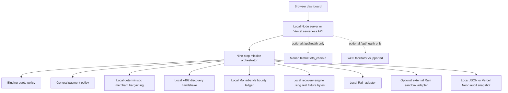

# Lazarus Mesh — Complete Project Guide

This document describes the code that is currently in this repository. It distinguishes local simulation, real local cryptographic work, external Rain sandbox activity, and read-only Monad testnet checks so that demo claims remain accurate.

No secret, API-key, private-key, user-ID, team-ID, contract-ID, or card-data value belongs in this guide. Configuration is documented by environment-variable name only.

## 1. What the project is

Lazarus Mesh is a local-first demonstration of an autonomous recovery marketplace for legally authorized but unavailable digital artifacts. The default mission starts with a bundled CC0 rainfall dataset at zero seeders and demonstrates an agent that can:

1. simulate availability-intelligence allocation through a local x402-style handshake;
2. bargain with a merchant inside a deterministic policy envelope;
3. record and claim a demo recovery bounty in a local Monad-style ledger;
4. create narrowly scoped payment authority through either a local Rain adapter or the external Rain sandbox;
5. block unrelated spending and simulate only the accepted quote;
6. recover and hash-check 24 real local data pieces;
7. reconstruct the original artifact and verify its SHA-256 commitment;
8. require a two-verifier quorum before reward release; and
9. restore two simulated seeders and retire payment authority.

The product thesis is **pay for verified recovery, not promises**. The agent can propose actions and counteroffers, but deterministic quote and payment policies decide whether money-like authority may be created or used.

This is not a general torrent search engine, an unrestricted purchasing agent, a production card application, or a system for recovering unauthorized, copyrighted, private, malicious, or access-controlled material.

## 2. What is real, remote, and simulated

The implementation has two supported adapter modes: `local` and `rain-sandbox`. The latter is a hybrid mode, not a fully live deployment.

| Capability | `local` mode | `rain-sandbox` mode | Truthful status |
| --- | --- | --- | --- |
| Rain card/payment control | In-memory local adapter | Authenticated HTTPS calls to Rain's sandbox APIs | Local simulation or remote sandbox simulation; never a production card purchase |
| Merchant bargaining | Deterministic local Atlas merchant | The same deterministic local Atlas merchant | Simulated structured bargaining; no live merchant, chat, browser checkout, or LLM negotiation |
| x402 discovery payment | Local HTTP-402-shaped requirement and receipt | The same local adapter | Simulated settlement; no token transfer and no facilitator used for execution |
| Monad bounty lifecycle | In-memory local bounty ledger | The same local bounty ledger | Simulated execution; hash-like receipts are not explorer transactions |
| Monad/x402 network readiness | Optional read-only health probe | Optional read-only health probe | Real network reads only when both probe origins are configured; no signing or writes |
| Artifact recovery | Reads bundled fixture bytes, splits, hashes, verifies, and reconstructs them | The same local recovery engine | Real local bytes and real SHA-256/Merkle calculations; no peer-to-peer retrieval |
| Verifier quorum | Scripted local identities | Scripted local identities | Simulated verifier independence |
| Reseeding | Mission state changes to two seeders | The same | Simulated availability; no BitTorrent/IPFS seeding process starts |
| Local persistence | JSON audit snapshot plus in-memory adapter ledgers | The same | Local CLI persistence only |
| Vercel persistence | Free Neon Postgres JSONB snapshot | Free Neon Postgres JSONB snapshot | Durable deterministic-demo state; not a normalized payment or chain operation ledger |
| Solidity contract | Reference source only | Reference source only | Not compiled, deployed, called, or audited by this application |

The most important runtime boundary is:

```text
Rain sandbox can be externally connected.
Bargaining, x402 settlement, Monad bounty execution, recovery, and verifier logic remain local.
Monad testnet access is read-only readiness checking only.
```

## 3. Architecture and trust boundaries



| Boundary | Responsibility |
| --- | --- |
| Agent/orchestrator | Advances a fixed mission, requests quotes, and proposes payment intents. It does not bypass validation. |
| Quote policy | Proves that the merchant response is binding, intact, current, in-session, in-budget, and term-compatible. |
| Payment policy | Revalidates the exact spend against rights, rail, merchant, MCC, purpose, count, amount, budget, expiry, approval, duplicate, and kill-switch rules. |
| Rain adapter | Creates and exercises narrow card-like authority. In hybrid mode, some controls are remote sandbox controls and others remain application controls. |
| Monad adapter | Models bounty creation, provider stake, verifier quorum, and tranche releases. It is local in every current run mode. |
| Recovery hashes | Verify the actual local bytes against piece hashes, a Merkle root, and a full-artifact SHA-256. |
| Verifiers | Supply the two passing attestations required by the local Monad adapter. Their independence is scripted, not decentralized. |

## 4. Requirements and run modes

The server requires Node.js 20 or later. It uses Node built-ins and browser-native JavaScript; there is no runtime dependency installation step.

### Local mode

```sh
node server.js
```

or:

```sh
npm run start
```

Open [http://127.0.0.1:4173](http://127.0.0.1:4173). The server is hard-bound to `127.0.0.1`; changing `PORT` changes only the port and does not expose the app to the LAN.

```sh
PORT=5000 node server.js
```

Local mode needs no secrets. By default it makes no payment or chain network calls. If both Monad-readiness origins are configured, requesting `/api/health` can still perform the optional read-only probe described later.

### Rain sandbox hybrid mode

Set `ADAPTER_MODE=rain-sandbox`, provide the Rain sandbox environment variables described below, and start the same server:

```sh
ADAPTER_MODE=rain-sandbox node server.js
```

The application loads a repository-root `.env` file only when `server.js` is run as the main program. Existing process-environment values take precedence and are never overwritten by that loader. Tests normally inject configuration directly.

Only `local` and `rain-sandbox` are accepted. An unsupported `ADAPTER_MODE` fails startup; there is no silent fallback from sandbox to local execution.

### Development and test commands

```sh
npm run dev
npm run test
npm run check
```

`npm run dev` uses Node watch mode. `npm run test` runs `node --test`. `npm run check` checks `server.js` syntax and then runs the full Node test suite.

## 5. Configuration reference

### Rain sandbox

| Variable | Required | Purpose |
| --- | --- | --- |
| `RAIN_API_BASE_URL` | Yes in hybrid mode | HTTPS base URL for the Rain sandbox API. |
| `RAIN_API_KEY` | Yes in hybrid mode | Server-side Rain API credential. It must never reach the browser, state, logs, or audit export. |
| `RAIN_USER_ID` | Yes in hybrid mode | Rain sandbox issuing-user UUID. |
| `RAIN_TEAM_ID` | Optional | Rain team UUID added to the health query when present. |
| `RAIN_CONTRACT_ID` | Yes in hybrid mode | Rain contract UUID used by the sandbox collateral-funding simulation. This is a Rain identifier, not a Monad bounty-contract deployment. |
| `RAIN_AUTO_FUND_MINOR` | Optional | Sandbox rUSD collateral amount simulated before first card creation. Default: `2000`; set to `0` to skip auto-funding. |
| `RAIN_TIMEOUT_MS` | Optional | Rain request timeout. Default: `12000`; runtime clamps it to 1–30 seconds. |

The adapter validates the base URL as HTTPS, validates UUID-shaped identifiers, and rejects missing/too-short API credentials before it can run.

### Monad and x402 readiness metadata

| Variable | Current effect |
| --- | --- |
| `MONAD_NETWORK` | Display/readiness network label; defaults to `eip155:10143`. It does not change local execution. |
| `MONAD_CHAIN_ID` | Display/readiness metadata; defaults to `10143`. It does not change the fixed probe expectation or local ledger. |
| `MONAD_RPC_URL` | HTTPS origin for the read-only `eth_chainId` check. |
| `X402_FACILITATOR_URL` | HTTPS origin whose `/supported` endpoint is checked. |
| `MONAD_PROBE_TIMEOUT_MS` | Probe timeout; defaults to `5000`. |
| `MONAD_PRIVATE_KEY` | Reported only as `signerConfigured: true/false`; no current code signs with it. |
| `MONAD_BOUNTY_CONTRACT` | Reported only as `contractConfigured: true/false`; no current code calls it. |
| `MONAD_PAY_TO_ADDRESS` | Reported only as `payToConfigured: true/false`; no live x402 settlement uses it. |
| `MONAD_USDC_ADDRESS` | Reported as readiness configuration internally; no current write path uses it. |

The network probe runs only if **both** `MONAD_RPC_URL` and `X402_FACILITATOR_URL` are configured. Setting only one does not perform a partial probe. `writesEnabled` is always `false`.

## 6. Default mission and economics

The default mission is **Restore the CC0 Rainfall Dataset**. It uses the bundled fixture at `fixtures/cc0-rainfall-dataset/rainfall-sample.json` and the corresponding CC0 declaration.

All money-like values are integer minor units.

| Item | Default amount | Counted in `budget.spentMinor`? |
| --- | ---: | --- |
| x402 availability intelligence | `$0.01` | Yes |
| Merchant's initial archive ask | `$12.00` | No; it is an offer, not a purchase |
| Accepted archive quote | `$9.75` | Yes |
| Built-in unrelated challenge | `$9.00` | No; it is declined |
| Manual policy challenge | `$250.00` | No; it is declined |
| Recovery bounty | `$5.00` | No; tracked separately as the local reward/escrow model |
| Provider collateral requirement | `$2.00` | No; tracked separately in the local Monad ledger |
| Total mission budget | `$20.00` | External-spend ceiling |
| Successful external-style spend | `$9.76` | `1 + 975` minor units |

The `$5.00` reward is released cumulatively:

| Milestone | Cumulative | Incremental release |
| --- | ---: | ---: |
| Verified recovery | 70% | `$3.50` |
| Retained availability | 90% | `$1.00` more |
| Replication/completion | 100% | `$0.50` more |

New mission creation retains a conservative minimum recovery-service spend cap of `1201` minor units: the one-cent discovery payment plus the `$12.00` maximum bargaining ceiling. The deterministic successful run actually spends `976` minor units after negotiation. The provider bounty is funded and reported separately.

The server validates a custom reward in the 100–100,000 minor-unit range and a recovery-service spend cap in the 1,201–500,000 minor-unit range; it rejects rather than silently clamps invalid values. The provider bounty and service cap are separate commitments, and the UI shows maximum authorized exposure as their sum. The title is trimmed and capped at 100 characters. Every mission requires `rightsAttestation: true`, and unsupported content roots, piece counts, or licenses fail closed instead of being ignored. The current form still uses the bundled fixture and does not ingest arbitrary user data.

## 7. The complete nine-step behavior

The reusable state machine permits only forward transitions:

```text
DEAD
  -> DISCOVERING
  -> FUNDED
  -> RECOVERING
  -> VERIFYING
  -> VERIFIED
  -> RESEEDED
  -> COMPLETED
```

The orchestrator exposes nine actions because three recovery batches occur while the mission is in `RECOVERING`.

### Step 1 — discover availability, then bargain

- The local x402 adapter creates a `402` payment requirement for the content root.
- The payment requirement describes the `exact` scheme, network `eip155:10143`, asset `USDC`, amount `1`, and an availability resource path.
- Local settlement records a synthetic one-cent receipt, two candidate providers, Atlas as the recommended provider, a 45-second estimate, a `$12.00` estimate, and confidence `0.94`.
- Mission spend increases from `0` to `1` minor unit.
- **After discovery is complete, a separate negotiation session starts.** Atlas asks `$12.00`; the bounded two-round transcript reaches `$9.75` and creates a binding quote.
- State becomes `DISCOVERING`, availability becomes `8`, and the event log explicitly says bargaining happened in a separate quote session.

### Step 2 — fund the recovery bounty

- The local Monad adapter creates a bounty keyed by mission and content root.
- The default reward is `$5.00`; the provider must post/model `$2.00` collateral when claiming.
- A synthetic confirmed receipt is added to the transaction list.
- State becomes `FUNDED` and availability becomes `12`.

No on-chain escrow is funded in the current implementation.

### Step 3 — revalidate, claim, scope, challenge, and settle

- A binding quote is mandatory. Missing it fails with `BINDING_QUOTE_REQUIRED`.
- The quote policy runs again immediately before payment authority is created, catching expiry or mutation since step 1.
- The quote is converted into an exact payment policy: Rain card only, Atlas merchant only, MCC `5734` only, purpose `archival_egress` only, `$9.75` per transaction, one transaction, quote expiry, rights required, and the mission kill switch.
- The `$9.75` accepted quote is below the `$10.00` automatic negotiation approval threshold.
- The general payment policy performs a separate preflight.
- The local Monad adapter records the Atlas provider claiming the bounty and the `$2.00` stake requirement.
- Rain creates a scoped card tied to the mission and quote. It stores safe metadata only.
- The built-in challenge proposes an unrelated `$9.00` luxury purchase using merchant `merchant_luxury_market`, MCC `5944`, and purpose `unrelated_purchase`. It is deliberately within the dollar ceiling so that merchant/MCC/purpose scoping—not merely amount—blocks it.
- The exact `$9.75` Atlas archival-egress purchase is authorized and settled.
- Mission spend becomes `976` minor units: `$0.01 + $9.75`.
- The negotiation state becomes `consumed`, preventing the quote from being treated as unused authority.
- State becomes `RECOVERING` and availability becomes `16`.

In hybrid mode the deliberate challenge also exercises Rain's remote MCC sandbox control. If Rain unexpectedly authorizes it, the adapter requests an immediate reversal and still returns a denied application result.

### Step 4 — recover the first batch

- The local recovery adapter releases the actual first 8 of 24 fixture pieces into the recovery session.
- Each visible piece reports missing/recovered/verified progress and a short hash prefix.
- State remains `RECOVERING`, status text reports `8 of 24`, and availability becomes `34`.

### Step 5 — recover the second batch

- Recovery advances through 16 of 24 actual local pieces.
- State remains `RECOVERING`, status text reports `16 of 24`, and availability becomes `58`.

### Step 6 — recover and verify every piece

- All 24 pieces are recovered.
- Every piece is SHA-256 checked against its manifest descriptor.
- North and East, the first two scripted verifier identities, move to `passed`; West remains unused.
- Audit quorum becomes `2/2`.
- State becomes `VERIFYING` and availability becomes `82`.

### Step 7 — reconstruct, attest, and release 70%

- The 24 verified pieces are concatenated in order.
- The reconstructed artifact SHA-256 must exactly equal the manifest's full-content SHA-256.
- The local Monad adapter records two unique passing verifier attestations.
- The recovery tranche releases the reward to 70% cumulative (`$3.50` for the default mission).
- State becomes `VERIFIED`, `audit.rootMatched` becomes true, and availability becomes `94`.

### Step 8 — model retained availability and release to 90%

- The local Monad adapter releases the reward to 90% cumulative (`$1.00` incremental).
- The mission records two seeders and moves the provider to `reseeding`.
- State becomes `RESEEDED` and availability becomes `100`.

The two seeders are mission-state simulation; the application does not start two network seeding processes.

### Step 9 — release the remainder and retire authority

- The local Monad adapter releases the final 10%, reaching 100% (`$0.50` incremental).
- The provider becomes `completed`, the mission gets `completedAt`, and state becomes `COMPLETED`.
- In local mode, the Rain card becomes `retired` immediately.
- In Rain sandbox mode, local application authority is disabled and the card becomes `expiry_scheduled`; the remote card remains restricted by its short quote expiry because the public sandbox flow used here has no card-cancel operation.
- Final Rain and reconciliation events are added.

### Execution controls

- `step()` advances exactly one remaining step and is idempotent after step 9.
- `run()` advances all remaining steps with a presentation delay.
- A per-mission run lock returns a conflict for concurrent manual/run execution.
- Reset increments an internal generation counter. A pre-reset asynchronous run cannot save stale state over the new session.
- Each mission retains at most 100 events.

## 8. x402 discovery is not merchant bargaining

These are intentionally separate operations even though both occur in step 1.

| Operation | Question answered | Current adapter | Financial truth |
| --- | --- | --- | --- |
| x402 discovery | “Who may have this artifact, and what is the rough estimate?” | `LocalX402Adapter` | One-cent local receipt; no facilitator or token transfer |
| Merchant negotiation | “What binding price and terms will Atlas accept?” | `LocalNegotiationAdapter` | Deterministic local transcript; no merchant network call |

The x402 result's `$12.00` estimate is not a binding quote and cannot authorize Rain. Only the later merchant quote, after digest and policy validation, can be converted into card scope.

The local x402 receipt is idempotent for mission/content-root identity. Its transaction hash is synthetic. Configuring `X402_FACILITATOR_URL` only enables the optional `/supported` readiness check; it does not change settlement execution.

## 9. Merchant bargaining

### Exact default transcript

The only current merchant profile is Atlas Archive Cloud, associated with Atlas Archive Node.

| Sequence | Speaker | Action | Amount | Meaning |
| ---: | --- | --- | ---: | --- |
| Offer | Atlas | Initial ask | `$12.00` | Merchant starts at the configured maximum ceiling. |
| Round 1 | Buyer | Counter | `$9.00` | The mission's target price. |
| Round 1 | Atlas | Counter | `$10.50` | Deterministic midpoint between the current ask and buyer counter, bounded by Atlas's floor. |
| Round 2 | Buyer | Counter | `$9.75` | Best-within-policy midpoint between the target and seller counter. |
| Round 2 | Atlas | Accept | `$9.75` | Atlas's configured floor is met; a binding quote is issued. |

The result saves `$2.25`, or `18.75%`, from the initial ask. The session uses two buyer counteroffer rounds. Mission policy allows up to three rounds, so the accepted result is within the limit.

### Exact accepted terms

```json
{
  "purchaseModel": "one_time",
  "service": "archival_egress",
  "autoRenewal": false,
  "dataSharing": false,
  "exclusivity": false
}
```

The quote is:

- for merchant `merchant_atlas_archive` and MCC `5734`;
- for provider `provider_atlas_archive`;
- bound to the mission content root and `archival_egress` purpose;
- denominated in USD minor units;
- marked `binding: true`;
- issued with a 15-minute expiration; and
- committed by a canonical SHA-256 `quoteDigest`.

The adapter rejects malformed session/offer IDs, unsupported providers, ceilings below Atlas's `$9.75` floor, invalid/non-positive amounts, offer-session mismatch, finalized sessions, maximum-round violations, non-improving counters, and unsupported terms. Calls use deterministic local IDs and idempotency keys, and returned state is cloned so caller mutation cannot alter the adapter's stored session.

This is a safe integration shape for future live merchant APIs, but the present negotiation is a deterministic simulation. There is no generative-agent bargaining, free-form merchant chat, browser automation, or real quote endpoint.

### Negotiation API behavior

Step 1 runs bargaining automatically. `POST /api/missions/:id/negotiation` exists for explicit execution/replay after discovery:

- before step 1 it returns a conflict with `DISCOVERY_REQUIRED`;
- after an accepted or consumed quote it returns the same accepted quote state rather than bargaining again; and
- `GET` returns the mission's public negotiation record.

## 10. Binding-quote validation

`src/domain/negotiation-policy.js` is a fail-closed layer separate from the general spending policy. The quote is checked once when negotiation accepts it and again at step 3 before card creation.

The canonical digest commits to exactly these fields:

```text
quoteId, sessionId, merchantId, merchantName, providerId, mcc,
contentRoot, purpose, amountMinor, currency, terms, binding,
issuedAt, expiresAt
```

Validation checks, in order:

1. the response is explicitly binding;
2. it belongs to the expected negotiation session;
3. its recomputed canonical digest matches `quoteDigest`;
4. issued/expiry/current timestamps are valid and expiry is after issue;
5. the quote has not expired (`now >= expiresAt` is expired);
6. merchant ID is allowed;
7. MCC is allowed;
8. content root matches the mission;
9. purpose equals the required service;
10. currency is allowed;
11. amount is a positive safe integer;
12. amount is at or below the negotiation ceiling;
13. current spend plus quote fits the mission budget;
14. round count is at or below the limit;
15. the terms object has exactly the required keys and values; and
16. the quote is at or below the automatic approval threshold unless human approval is explicitly supplied.

Stable quote decision codes are:

```text
QUOTE_OK
QUOTE_NOT_BINDING
QUOTE_EXPIRED
QUOTE_INTEGRITY_MISMATCH
QUOTE_SESSION_MISMATCH
QUOTE_MERCHANT_NOT_ALLOWED
QUOTE_MCC_NOT_ALLOWED
QUOTE_RESOURCE_MISMATCH
QUOTE_PURPOSE_NOT_ALLOWED
QUOTE_CURRENCY_NOT_ALLOWED
QUOTE_AMOUNT_INVALID
QUOTE_CEILING_EXCEEDED
QUOTE_BUDGET_EXCEEDED
QUOTE_TERMS_NOT_ALLOWED
NEGOTIATION_ROUNDS_EXCEEDED
QUOTE_APPROVAL_REQUIRED
QUOTE_TIMESTAMP_INVALID
```

A valid quote is necessary but not sufficient: the exact payment intent must then pass `evaluatePolicy()`.

## 11. General payment policy

`src/domain/policy.js` evaluates one intent deterministically. It returns an immutable allowed/denied decision with a stable code rather than treating ordinary denials as exceptions.

Checks happen in this order:

1. kill switch;
2. mission active state;
3. valid current timestamp;
4. mission expiry;
5. policy expiry;
6. rights evidence;
7. blocked content hash;
8. duplicate intent/idempotency key;
9. allowed rail;
10. provider, merchant, recipient, MCC, and purpose restrictions;
11. transaction-count limit;
12. valid non-negative amount;
13. per-transaction limit;
14. aggregate budget limit; and
15. human-approval threshold.

Stable policy codes are:

```text
POLICY_OK
RIGHTS_EVIDENCE_REQUIRED
CONTENT_HASH_BLOCKED
MISSION_INACTIVE
MISSION_EXPIRED
POLICY_EXPIRED
PROVIDER_NOT_ALLOWED
MERCHANT_NOT_ALLOWED
RECIPIENT_NOT_ALLOWED
MCC_NOT_ALLOWED
PURPOSE_NOT_ALLOWED
RAIL_NOT_ALLOWED
TOO_MANY_TRANSACTIONS
PER_TRANSACTION_LIMIT_EXCEEDED
TOTAL_BUDGET_EXCEEDED
APPROVAL_REQUIRED
DUPLICATE_INTENT
KILL_SWITCH_ACTIVE
INVALID_AMOUNT
INVALID_TIMESTAMP
```

Limits are inclusive, approval is required only above the threshold, and expiry boundaries are exclusive (`now >= expiry` denies). The rail selector elsewhere in the domain prefers eligible x402/Monad service payments, then Rain card, then Rain payout, but the nine-step mission directly uses the adapters described above.

## 12. Rain integration

Rain is the conventional-commerce payment-control rail. It does not fund the recovery bounty and does not decide whether reconstructed bytes are valid.

### Local Rain adapter

`LocalRainAdapter` is entirely in memory. It creates card-like metadata containing:

- principal, mission, and quote IDs;
- merchant-ID and MCC allowlists;
- exact maximum amount;
- maximum transaction count;
- expiry and purpose;
- simulated last four digits; and
- active/retired state.

Authorization fails closed for a missing, inactive, expired, exhausted, oversized, wrong-merchant, or wrong-MCC purchase. A successful authorization increments the count. Scope arrays are copied and frozen so a caller cannot widen an already-created card.

No network call, card, bank balance, or money exists in this adapter. Local retirement is immediate.

### External Rain sandbox adapter

`RainSandboxAdapter` performs real authenticated HTTPS requests to Rain's sandbox, but those endpoints simulate issuing and transactions. It does not perform a production card payment or move real merchant funds.

Current request flow:

```text
GET  /issuing/transactions
POST /simulate/collateral/fund
POST /issuing/users/{userId}/cards/scoped
POST /simulate/transactions/authorize
POST /simulate/transactions/{transactionId}/settle
POST /simulate/transactions/{transactionId}/reverse
GET  /issuing/cards/{cardId}
```

- The transactions query is the authenticated health check.
- Collateral funding simulates rUSD setup once before first card creation when auto-funding is nonzero.
- Scoped-card creation sends the exact accepted amount, quote expiry, and allowed MCCs.
- The approved transaction is authorized and then settled; the settlement request sends an explicit `{ "amount": purchase.amountMinor }` JSON body because the current sandbox validator expects the optional amount to be present.
- Reversal is used only if the deliberate remote-control challenge unexpectedly authorizes.
- Card lookup reconciles safe status metadata.

### Rain request hardening

- The API key remains server-side in the `Api-Key` header.
- Card creation generates an encrypted `sessionid` with a pinned sandbox public key; transient plaintext secret buffers are zeroed after use.
- Idempotency keys are deterministic SHA-256 values and do not embed raw secrets.
- Requests use manual redirects and permit at most three same-origin redirects; cross-origin redirects are blocked.
- Timeout is bounded, and network errors, HTTP 429, and 5xx responses receive limited exponential-backoff retries.
- Provider failures are reduced to safe codes/messages instead of returning raw response bodies.
- UUID and response-shape validation fails closed.

### Rain enforcement split

The sandbox scoped-card endpoint used by this adapter directly receives amount, MCC, and expiry controls. It does not receive Lazarus merchant ID, content root, purpose, quote digest, or transaction-count policy.

| Control | Enforced by current application | Enforced by Rain sandbox call |
| --- | --- | --- |
| Exact `$9.75` binding quote | Yes | Amount ceiling is sent remotely |
| Merchant identity | Yes | Not represented in scoped-card creation |
| MCC `5734` | Yes | Yes |
| Quote expiry | Yes | Yes |
| One-transaction limit | Yes | Not represented in scoped-card creation |
| Purpose/content root/task scope | Yes | Not represented in scoped-card creation |
| Quote digest and accepted terms | Yes | No |

The application checks its policy before a normal remote authorization. The built-in unrelated-purchase demo deliberately allows the wrong-MCC attempt to reach Rain so the remote sandbox control is exercised too.

### Sensitive card-data handling

Rain's card-creation response may include encrypted PAN/CVC material. The adapter intentionally never copies those fields into its card object. They do not enter JSON state, SSE, audit export, browser code, or application logs. Only safe fields such as card ID, last four, status, scope, and timestamps are retained.

### Sandbox retirement and reset limitation

The public sandbox flow used here has no remote card-cancel call. At completion, the app:

1. disables local authority immediately;
2. records `expiry_scheduled`; and
3. relies on the binding quote's short remote expiry to end the remaining sandbox card lifetime.

Reset is blocked with `RAIN_SANDBOX_AUTHORITY_ACTIVE` while the running session records an unexpired Rain sandbox card as either `active` or `expiry_scheduled`. Completing the mission disables local use, but reset still waits for the recorded remote expiry because the sandbox exposes no cancel endpoint. A fresh hybrid startup uses the same rule and raises `RAIN_SANDBOX_AUTHORITY_UNRESOLVED` rather than forgetting remote authority. Repeated demos can consume sandbox card quotas.

## 13. Monad integration

Monad is the bounty/collateral/verifier/reward coordination rail. It does not perform the Rain merchant charge.

### Current execution: local only

`LocalMonadAdapter` is used in both supported modes. It implements:

- `createBounty()` — opens one bounty with sponsor, content root, reward, and stake requirement;
- `claimBounty()` — assigns the provider and marks the bounty claimed;
- `recordAttestations()` — validates up to 32 attestations and requires at least two unique passing verifier IDs; and
- `releaseTranche()` — moves reward release monotonically to a cumulative percentage from 1 to 100.

It labels receipts with chain ID `10143`, a local simulated block number, and a hash-shaped transaction ID, but also labels the network `local-monad-simulation`. These receipts are not submitted to Monad, cannot be found in an explorer, and do not escrow tokens or native collateral.

The adapter rejects duplicate bounties, invalid claims, missing/nonpassing quorum, out-of-order releases, decreasing/duplicate percentages, and release before verification.

### Optional read-only testnet readiness probe

`src/services/monad-network.js` is not an execution adapter. `/api/health` calls it only when both the RPC and facilitator origins are configured.

The probe performs two reads in parallel:

1. a JSON-RPC `eth_chainId` call, which must report Monad testnet chain `10143`; and
2. `GET /supported` on the facilitator, which must advertise x402 version 2, the `exact` scheme, and `eip155:10143`.

Probe hardening includes:

- HTTPS origins only;
- no username, password, path, query, or fragment in configured origins;
- manual same-origin redirects only, with unsafe POST redirect changes blocked;
- a maximum of three redirects;
- timeouts that include response-body reading;
- a 64 KiB maximum response;
- strict JSON/chain/support validation; and
- sanitized public error codes.

If both origins are configured and either check fails, `/api/health` returns HTTP 503. If the pair is not configured, the probe reports `configured: false` and does not make overall health fail.

### What is still required for Monad writes

The repository does not contain a connected Monad write path. Live execution would require all of the following, none of which is supplied merely by Rain user/team/API identifiers:

- a valid Monad signing key kept only on the server or a secure signer;
- a funded testnet wallet;
- a compiled and deployed `RecoveryBountyRegistry` address;
- the correct reward-token/stablecoin address and allowance flow;
- a pay-to address and verified x402 facilitator settlement flow;
- transaction simulation, nonce/gas/retry/reconciliation handling;
- confirmed-receipt and reorganization handling; and
- an explicit Monad adapter wired into `createApplication()`.

The current server may report whether signer/contract/pay-to environment fields are populated, but it never reads them for signing and always reports `writesEnabled: false`.

## 14. Solidity reference contract

`contracts/RecoveryBountyRegistry.sol` is an unaudited future integration reference using Solidity `^0.8.24`. The JavaScript application does not compile, deploy, import, or call it.

The reference models:

- a fixed ERC-20 reward token;
- native-currency provider collateral;
- mission creation, claim, verification, retention, dispute, expiry, and completion phases;
- an owner-managed pause and verifier allowlist;
- EIP-712 typed verifier attestations, signer/nonce/digest replay protection, and one vote per verifier per checkpoint;
- recovery, availability, and replication evidence stages;
- 70%, 20%, and 10% reward tranches, including rounding remainder;
- dispute resolution and deadline-based expiry; and
- credit-and-withdraw native collateral payouts.

A contract cannot itself inspect off-chain files or prove seeder independence. Even a future deployment would still depend on a defensible verifier/oracle design. Do not use this reference with real value without compilation tests, unit/invariant/fuzz testing, deployment scripts, external audit, and governance review.

## 15. Recovery and integrity engine

`LocalRecoveryAdapter` is the part of the demo that handles actual content bytes.

It:

1. reads the bundled JSON fixture;
2. splits it into 24 ordered byte ranges;
3. calculates SHA-256 for each range;
4. builds a binary Merkle tree, duplicating an odd final node when necessary;
5. calculates the full artifact SHA-256;
6. normalizes and fully validates the manifest before starting a session;
7. releases real local piece buffers in three batches;
8. verifies recovered piece hashes;
9. reconstructs only after every piece is verified; and
10. compares the reconstructed full SHA-256 with the manifest commitment.

Manifest normalization checks digest shape, piece ordering, byte lengths, count consistency, piece data, total bytes, artifact hash, and Merkle root. Corruption fails with a piece/hash or reconstruction error.

Internal `_source` and `_pieceBytes` values are required for the local fixture engine but are stripped from every public state response by the orchestrator's recursive serializer.

This is real local integrity verification, not real network recovery. There is no BitTorrent DHT/tracker, IPFS, archive API, HTTP-range worker, malware scanner, sandboxed content processor, or independent reseeding service.

## 16. State and audit model

Top-level state uses `schemaVersion: 1`, one active mission ID, system truth metadata, and a mission array.

Important mission fields:

| Field | Meaning |
| --- | --- |
| `id`, `title`, `objective` | Mission identity and goal. |
| `status`, `statusLabel`, `stepIndex`, `running` | Canonical lifecycle and execution state. |
| `principal`, `provider`, `verifiers` | Scripted demo identities and their progress. |
| `rightsEvidence`, `deadline` | Rights basis and mission expiry. |
| `manifest`, `contentRoot`, `pieces` | Public integrity commitment and piece progress. |
| `availability`, `seeders` | Presentation availability score and simulated seeder count. |
| `budget` | Total, external spend, reward, released reward, and provider stake in minor units. |
| `policy` | Original mission rights, merchant, MCC, limit, expiry, rail, approval, and kill-switch envelope. |
| `negotiation` | Target/ceiling, allowed merchant/MCC/currency, exact terms, offers, rounds, accepted quote, decision, savings, and consumption state. |
| `rainCard` | Safe local/sandbox card metadata; never PAN/CVC. |
| `payments`, `transactions` | x402, Rain, and local Monad receipts. |
| `policyDecisions` | Explicit allowed/denied policy records. |
| `audit` | Expected/reconstructed SHA-256, root match, and verifier quorum. |
| `events` | Newest-first timeline capped at 100 records. |

`src/store.js` writes `.data/state.json` through a temporary file and rename. Invalid stored JSON is copied to a timestamped `.invalid-*` backup before fresh state is created.

Ordinary server startup replaces stored state with a fresh coherent session because the adapter ledgers are in memory and are not rehydrated. There is one critical hybrid-mode exception: before replacement, `rain-sandbox` startup inspects the prior snapshot and refuses to start when it contains an unexpired Rain sandbox card recorded as `active` or `expiry_scheduled`. It throws `RAIN_SANDBOX_AUTHORITY_UNRESOLVED` so remote authority cannot be silently forgotten; reconcile it or wait until its recorded expiry before starting a fresh hybrid session.

Step 3 also checkpoints the snapshot immediately after external card creation, after the deliberate Rain challenge, and after the approved Rain settlement. These intermediate saves preserve the known external authority and transaction receipts if a later network operation or process interruption prevents the whole step from completing. Final spend, negotiation-consumption, lifecycle, and event accounting is saved when the step completes.

These safeguards improve sandbox reconciliation, but `.data/state.json` is still an audit/debug snapshot rather than general crash-safe workflow resumption or an authoritative financial ledger.

The export endpoint returns a formatted mission audit containing the public mission, negotiation transcript, policy decisions, receipts, verifier state, and reconstruction result. It is locally useful but not tamper-proof because the same process controls state, adapters, and export.

## 17. HTTP API

| Method | Route | Behavior |
| --- | --- | --- |
| `GET` | `/api/health` | Reports runtime truth, Rain health, local execution status, and optional Monad/x402 readiness. Returns 503 when a configured external health dependency fails. |
| `GET` | `/api/state` | Returns recursively sanitized public application state. |
| `GET` | `/api/events` | Opens an SSE stream and immediately emits the current public state; later mutations broadcast new state events. |
| `POST` | `/api/demo/reset` | Resets all local adapter ledgers and creates the default state; blocked by unexpired recorded Rain sandbox authority. |
| `POST` | `/api/missions` | Creates a new bundled-fixture mission after rights and budget validation. |
| `POST` | `/api/missions/:id/step` | Executes the next of nine actions. |
| `POST` | `/api/missions/:id/run` | Runs every remaining action with a demo delay. |
| `GET` | `/api/missions/:id/negotiation` | Reads the public negotiation record. |
| `POST` | `/api/missions/:id/negotiation` | Executes or idempotently replays negotiation after discovery. |
| `POST` | `/api/missions/:id/blocked-purchase` | Exercises an additional `$250.00` unapproved purchase after card creation. |
| `GET` | `/api/missions/:id/export` | Downloads the mission as formatted audit JSON. |

### Health response truth

- `system.mode` is `local` or `hybrid-sandbox`.
- Rain reports local/sandbox mode, external status, and authenticated health without returning credential values.
- Monad always reports `execution: local-ledger` and `writesEnabled: false`.
- x402 always reports `execution: local-handshake` and `liveSettlementEnabled: false`.
- Negotiation reports local mode.
- Recovery reports `real-bytes-local`.
- Configuration is exposed only as booleans such as `signerConfigured`, never raw values.

### Manual blocked-purchase endpoint

The built-in step-3 challenge is deliberately `$9.00` and within the quote ceiling to show merchant/MCC/purpose enforcement. The separate endpoint submits `$250.00`, MCC `7995`, and an unapproved merchant after a card exists; its first applicable local card denial is normally the amount ceiling. Both are audit demonstrations and never add to successful spend.

### Error behavior

- Missing missions return 404.
- Concurrent mission execution and invalid step prerequisites return 409.
- Rights/budget/quote/config validation uses 4xx responses where applicable.
- Oversized request bodies return 413.
- Unmatched API routes return 404; unsupported static methods return 405.
- Unhandled route errors return a safe message plus an `X-Request-Id`/JSON `requestId` for correlation.

## 18. Browser dashboard

The UI is static HTML, CSS, and dependency-free JavaScript:

- `public/index.html` supplies semantic structure, controls, form/dialog, tab roles, live regions, and accessible labels.
- `public/styles.css` supplies the responsive desktop/mobile layout and dark/light visual system.
- `public/app.js` normalizes state, calls the API, renders the mission, subscribes to SSE, falls back to polling, exports audits, manages theme preference, and reports accessible notices.

Main areas:

| Area | Behavior |
| --- | --- |
| Top environment bar | Distinguishes local from hybrid sandbox and states that Monad writes remain local/read-only. |
| Mission sidebar | Lists and selects missions and opens mission creation. |
| Mission header | Shows status/root and exposes run, step, challenge, export, and reset controls. |
| Lifecycle | Compresses eight internal statuses into five presentation stages: Dead, Discovering, Recovering, Verified, and Reseeded. `FUNDED` folds into Discovering, `VERIFYING` into Recovering, and `COMPLETED` into Reseeded. |
| Metrics/piece map | Shows availability, recovered/verified pieces, seeders, remaining budget, and all 24 piece states. |
| Payment rails | Shows latest safe Rain, local Monad, and local x402 receipts. |
| Timeline | Shows newest mission events received through SSE. |
| Receipts tab | Displays payment/transaction evidence. |
| Deal tab | Displays ask, accepted price, savings, rounds, exact transcript, accepted terms, quote/session IDs, expiry, and quote-policy decision. |
| Verifiers tab | Displays verifier states and quorum. |
| Policy tab | Displays bounded mission and spending-policy details. |

The client escapes server-provided HTML values before rendering, supports keyboard movement across audit tabs, uses ARIA live regions and progress semantics, remembers theme in local storage when available, and polls `/api/state` every five seconds if SSE is unavailable or reconnecting.

The mission form visually accepts content/license/piece details, but the current server intentionally creates only the bundled CC0 fixture mission.

## 19. Server and integration security

### Local HTTP boundary

- The server binds only to `127.0.0.1`.
- Every request validates the `Host` header against `127.0.0.1`, `localhost`, or `::1`, blocking DNS-rebinding-style access.
- POST requests reject `Sec-Fetch-Site: cross-site` and mismatched `Origin` hosts.
- JSON bodies are limited to 1 MB and must parse cleanly.
- Static files are resolved only under `public/`; decoded path traversal is blocked.
- Headers include no-store caching, MIME sniffing prevention, frame denial, no-referrer policy, and a restrictive Content Security Policy.
- Public-state serialization strips every property whose key begins with `_`.

This is defense in depth for a loopback demo, not user authentication. The app has no accounts, sessions, CSRF token, authorization roles, TLS termination, rate limiting, durable audit signing, or multi-tenant isolation and must not be exposed as a production service.

### Secrets and payment data

- Secrets remain server-side environment values.
- Raw credentials are never returned from health or system state.
- Rain encrypted PAN/CVC fields are discarded rather than transformed or persisted.
- Provider response bodies and configured origins are not exposed as credential-bearing errors.
- Private keys, API keys, card material, and raw recovery bytes must never be added to browser JavaScript, SSE, audit JSON, logs, model prompts, or blockchain calldata.
- `.env` must remain ignored and uncommitted; use `.env.example` only for variable names/placeholders.

Credentials accidentally disclosed outside the repository should be rotated at their provider. Merely omitting them from documentation does not revoke them.

## 20. Failure modes and operational behavior

| Failure | Current behavior |
| --- | --- |
| Unsupported adapter mode | Startup throws; no fallback. |
| Invalid/missing Rain sandbox configuration | Hybrid startup throws `RAIN_INVALID_CONFIGURATION`. |
| Rain authentication/provider/network failure | Health returns 503 or the mission action fails with a sanitized Rain error; limited retries apply only to retryable failures. |
| Configured Monad RPC/facilitator mismatch | Health returns 503; mission bounty/x402 execution still remains local. |
| Only one Monad probe origin configured | Probe does not run; health reports the network check unconfigured. |
| Discovery not completed | Explicit negotiation returns `DISCOVERY_REQUIRED`. |
| No binding quote | Step 3 returns `BINDING_QUOTE_REQUIRED`. |
| Quote expired, mutated, over budget, wrong terms, or wrong scope | Quote policy denies with a stable `QUOTE_*` code before card creation/use. |
| Payment violates rights/rail/merchant/MCC/purpose/amount/count/budget/approval/kill switch | General policy or Rain card denies with a stable reason; declined charges do not increase spend. |
| Duplicate/local Monad lifecycle call | Adapter rejects invalid bounty, claim, attestation, or tranche state. |
| Piece or artifact corruption | Piece verification or reconstruction throws; reward release does not proceed. |
| Concurrent run/step | Conflict response; one active run per mission. |
| Reset during a local run | Generation cancellation prevents stale state from overwriting reset state. |
| Reset with unexpired sandbox card | Blocked with `RAIN_SANDBOX_AUTHORITY_ACTIVE` for both `active` and `expiry_scheduled` state. |
| Sandbox completion | Local authority is disabled, but remote cancellation is unavailable; expiry is scheduled. |
| Malformed/oversized API input | 400/413 response; server stays running. |
| Corrupt JSON snapshot | Store creates an `.invalid-*` backup and fresh state. |
| Server restart | Normally starts a fresh mission because in-memory ledgers cannot be rehydrated. Hybrid startup instead refuses with `RAIN_SANDBOX_AUTHORITY_UNRESOLVED` while the prior snapshot contains an unexpired `active` or `expiry_scheduled` Rain sandbox card. |

There is no distributed transaction across Rain, local state, and future chain infrastructure. Card creation, the deliberate Rain challenge, and approved Rain settlement are checkpointed as soon as each external mutation returns, but a later failure may still require reconciliation rather than rollback. That is why live adapters need durable idempotency, receipt reconciliation, webhook handling, and explicit recovery jobs before production use.

## 21. Tests and QA

The current Node suite contains six test files and reports **65 passing tests**:

| Test file | Coverage |
| --- | --- |
| `tests/domain.test.js` | General policy boundaries/codes, transitions, canonical hashes, manifests, corruption, simulation, and rail selection. |
| `tests/integration.test.js` | Full nine-step HTTP run, negotiation routes, exact economics, audit export, validation, reset/run safety, origin/Host/body protections, and state truth. |
| `tests/negotiation.test.js` | Two-round transcript, binding quote/digest, idempotency, cloning, failure cases, and quote-policy denial matrix. |
| `tests/rain-sandbox.test.js` | Rain endpoint/header/body mapping, idempotency, encrypted-session use, PAN/CVC redaction, authorization plus explicit-amount settlement, local merchant denial, remote MCC decline, expiry-scheduled retirement, and malformed-UUID rejection. |
| `tests/monad-network.test.js` | Chain/facilitator readiness, strict origins, redirect safety, response limits, timeouts, and sanitized failures. |
| `tests/services.test.js` | Local Rain scope, local Monad quorum/tranches, local x402 idempotency, and exact fixture reconstruction. |

```sh
node --test
```

The automated suite uses injected fake network functions for Rain and network-probe tests. It does not require secrets or contact Rain, Monad, or an x402 facilitator.

`qa/browser-qa.cjs` is a Playwright-driven browser QA script with checked-in desktop/mobile captures. It validates dashboard behavior and overflow and writes screenshots/audit artifacts. Its browser executable configuration is environment-specific, so it may need local adjustment before running on another machine.

## 22. Repository map

```text
server.js
  Loopback HTTP server, adapter selection, health checks, REST/SSE routes,
  request security, static serving, and runtime truth metadata.

src/config.js
  Minimal .env loader plus Rain and Monad/x402 configuration mapping.

src/orchestrator.js
  Nine-step workflow, bargaining orchestration, quote/payment gates, run locks,
  reset generation safety, audit events, and public-state sanitization.

src/demo-state.js
  Default mission, fixture manifest, economics, negotiation envelope, policies,
  scripted identities, initial audit record, and system state factory.

src/store.js
  Atomic-style local JSON snapshot writes and invalid-file backup behavior.

src/domain/canonical.js
  Deterministic object serialization and SHA-256 commitments.

src/domain/manifest.js
  Deterministic synthetic manifest helpers used by domain tests.

src/domain/negotiation-policy.js
  Quote digest field set and fail-closed binding-quote validation.

src/domain/policy.js
  General deterministic spending policy and stable decision codes.

src/domain/rail.js
  Deterministic x402/Rain payment-rail preference logic.

src/domain/state-machine.js
  Canonical lifecycle and forward-transition enforcement.

src/domain/simulation.js
  Lightweight immutable recovery scenes used for deterministic replay/tests;
  not the HTTP orchestrator.

src/domain/index.js
  Domain-module exports.

src/lib/ids.js
  Local deterministic IDs, SHA helpers, and transaction-shaped hashes.

src/services/negotiation-local.js
  Deterministic Atlas offer/counter/quote state machine.

src/services/x402-local.js
  Local HTTP-402-shaped availability requirement and settled receipt.

src/services/rain-local.js
  In-memory scoped-card creation, authorization, and retirement.

src/services/rain-sandbox.js
  External Rain sandbox API adapter, safe response handling, retries,
  settlement/reversal, and expiry-scheduled retirement.

src/services/monad-local.js
  In-memory bounty, claim, quorum, and cumulative reward ledger.

src/services/monad-network.js
  Optional read-only Monad chain and x402 facilitator readiness probe.

src/services/recovery-local.js
  Real fixture-byte splitting, manifest normalization, piece verification,
  Merkle calculation, and reconstruction.

public/index.html
public/styles.css
public/app.js
public/favicon.svg
  Dependency-free responsive dashboard.

fixtures/cc0-rainfall-dataset/
  Bundled demonstration data and CC0 license declaration.

contracts/RecoveryBountyRegistry.sol
contracts/README.md
  Future Monad contract reference and warnings; not deployed or invoked.

tests/
  Domain, service, negotiation, Rain sandbox, network-probe, and HTTP tests.

docs/API_INTEGRATION.md
  Future adapter migration and security guidance.

docs/DEMO_SCRIPT.md
  Short presentation flow.

qa/
  Browser QA driver and reference desktop/mobile captures.

README.md
  Quick start and concise current-mode summary.

PROJECT_GUIDE.md
  This exhaustive implementation guide.

LAZARUS_MESH_MASTER_PLAN.md
RAIN_MONAD_DOSSIER.md
HACKATHON_BUILD_BRIEF.md
  Product architecture, sponsor research, and earlier planning context. These
  may describe future possibilities beyond the shipped runtime.

tmp/pdfs/
  Derived reference-document render used during project analysis; not runtime.
```

## 23. What would make it fully live

### Live merchant bargaining

Replace `LocalNegotiationAdapter` with a merchant/marketplace quote adapter while preserving the same `getOffers`, `sendCounterOffer`, and `getBindingQuote` boundary. A live implementation also needs authenticated merchant responses, signed/verifiable quote commitments, durable idempotency, timeout/replay protection, legal term normalization, cancellation, and human escalation when terms leave the approved envelope. The LLM may draft language, but deterministic policy must remain the authority.

### Live x402 settlement

Add a sponsor-approved x402 v2 client that validates scheme, network, asset/token address, amount, recipient, resource, expiry, nonce, facilitator response, and final receipt. Connect it to a funded server-side signer and durable payment reconciliation. The existing readiness probe is only a prerequisite check.

### Live Monad bounty execution

Compile, test, audit, and deploy the contract; implement a separate writer adapter; fund and approve the reward token; simulate each transaction; verify chain ID and contract code; wait for confirmed receipts; handle nonce races, reorgs, timeouts, replacement transactions, disputes, and restart reconciliation. Do not reuse the local synthetic receipt hashes as if they were chain transactions.

### Production Rain

Move beyond sandbox simulation only after confirming production API contracts, issuer/compliance requirements, merchant/MCC behavior, webhooks, signed events, reversal/dispute semantics, card cancellation, quotas, and secure card-data handling. Keep application quote policy even where Rain adds more remote controls.

### Real recovery and verification

Add isolated retrieval workers for approved sources, malware/content scanning, arbitrary signed manifest ingestion, resource limits, independent verifier infrastructure, challenge protocols, real retention proofs, and actual seeding. Off-chain availability claims must not be treated as trustless merely because a contract records signatures.

### Durable operation

Replace the JSON snapshot with transactional durable storage, append-only events, durable idempotency records, encrypted secret/receipt storage, job queues, reconciliation workers, authenticated users, authorization, rate limits, telemetry redaction, backups, and incident controls.

## 24. Demo success checklist

The current demo succeeds when all of the following are visible in state, UI, tests, or audit export:

- the CC0 artifact starts with zero seeders;
- the local x402 discovery handshake settles for one cent;
- x402 discovery and merchant bargaining are recorded as separate actions;
- Atlas's `$12.00` ask is bargained through `$9.00` and `$10.50` to a binding `$9.75` quote;
- accepted terms are one-time archival egress with no renewal, data sharing, or exclusivity;
- the quote digest and policy decision are `QUOTE_OK` before payment;
- the local Monad-style bounty is created and claimed with the stake requirement;
- an unrelated in-limit `$9.00` purchase is denied;
- the exact `$9.75` Atlas purchase settles;
- successful mission spend is exactly `$9.76`;
- all 24 real local pieces are recovered and verified;
- reconstructed SHA-256 matches the manifest;
- two scripted verifiers satisfy the `2/2` quorum;
- reward release reaches 70%, 90%, then 100%;
- two simulated seeders are restored;
- local Rain authority is retired, or hybrid sandbox authority is locally disabled and scheduled to expire;
- the mission reaches `COMPLETED`; and
- the audit JSON can be exported without secret or card data.

That is the complete, truth-labeled behavior implemented by the current repository.
